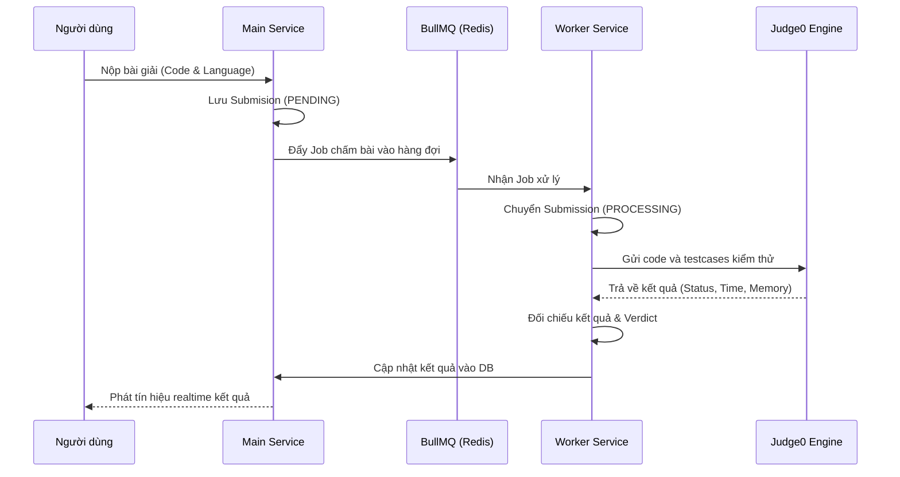

# 🏆 Online Code Judge (OCJ) - Backend Engine

Chào mừng bạn đến với backend monorepo của nền tảng **Online Code Judge (OCJ)**. Đây là một hệ thống chấm điểm mã nguồn trực tuyến hiệu năng cao, được thiết kế theo kiến trúc Microservices phân tán sử dụng **Turborepo** và **npm workspaces**. 

Hệ thống được thiết kế để chịu tải lớn, chấm bài tự động không đồng bộ thông qua hàng đợi BullMQ, ghép trận solo 1v1 thời gian thực, tích hợp AI huấn luyện học thuật và hệ sinh thái tương tác xã hội (diễn đàn, cửa hàng, vật phẩm, thi đấu tranh giải).

---

## ⚡ Các Tính Năng Cốt Lõi Đã Hoàn Thành

Hệ thống đã triển khai đầy đủ và kiểm thử thành công 12 module tính năng chính:

1. **Authentication & Session Manager**: Đăng ký, đăng nhập, đổi mật khẩu, quên/đặt lại mật khẩu qua email token, và quản lý/thu hồi phiên đăng nhập đa thiết bị (Revoke Sessions).
2. **Problem & Testcase Engine**: CRUD bài tập với giới hạn thời gian/bộ nhớ, gắn thẻ phân loại (Tags), và quản lý bộ testcase (ẩn/công khai).
3. **Async Code Execution (Judge0)**: Chấm bài không đồng bộ qua hàng đợi BullMQ & Redis, hỗ trợ tự động dịch/chạy offline khi thiếu API Key của Judge0.
4. **Realtime Solo Matchmaking 1v1**: Tìm kiếm đối thủ đồng hạng, tự động tạo phòng thi đấu, so khớp lời giải thời gian thực qua WebSockets (Socket.io) và cập nhật ELO theo công thức chuẩn.
5. **AI DSA Roadmap & Mock Interview**: Tích hợp Google Gemini AI để thiết lập lộ trình học thuật cá nhân hóa và nhận xét chi tiết bài làm giả lập nhà tuyển dụng (mock interview feedback).
6. **Custom Competition Rooms**: Người dùng tự tạo phòng đấu mã nguồn, tùy chỉnh thời gian làm bài, chọn bộ bài tập và mời bạn bè tham gia.
7. **Official Contests**: Giải đấu chính thức do Admin tổ chức với bảng xếp hạng realtime, tự động đóng/mở theo lịch trình và tính điểm số.
8. **Discussions & Comments**: Hệ thống thảo luận phân cấp dưới mỗi bài tập (Comments, replies) giúp lập trình viên trao đổi giải thuật.
9. **Social & Friendship**: Quản lý bạn bè (gửi lời mời, chấp nhận, chặn người dùng), và theo dõi trạng thái online.
10. **Shop & Coins**: Tích lũy Code Coins khi giải bài tập, mua sắm các hiệu ứng trang trí avatar/hồ sơ (Avatar Frames, Profile Themes) và trang bị chúng.
11. **Instant Notifications**: Thông báo realtime khi có lời mời kết bạn, kết quả trận đấu hoặc thông báo hệ thống từ Admin.
12. **Report & Flagging System**: Hệ thống báo cáo nội dung xấu (bình luận độc hại, gian lận) gửi đến ban quản trị xử lý.

---

## 📂 Danh Mục Tài Liệu Chi Tiết (Thư mục `AI_SLOP_2`)

Vui lòng xem chi tiết kỹ thuật của từng phần tại các tài liệu chuyên biệt dưới đây:

*   **[completed_features.md](file:///d:/.Learn/Fessior/online-code-judge/AI_SLOP_2/completed_features.md)**: Chi tiết kiến trúc kỹ thuật của 12 nhóm tính năng cốt lõi.
*   **[api_endpoints.md](file:///d:/.Learn/Fessior/online-code-judge/AI_SLOP_2/api_endpoints.md)**: Đặc tả kỹ thuật đầy đủ cho mọi RESTful API Endpoints (Request/Response & Phân quyền).
*   **[test_guide.md](file:///d:/.Learn/Fessior/online-code-judge/AI_SLOP_2/test_guide.md)**: Tài liệu hướng dẫn chạy thử nghiệm hệ thống, tích hợp kiểm thử Jest, và kịch bản test realtime 1v1.
*   **[suggested_endpoints.md](file:///d:/.Learn/Fessior/online-code-judge/AI_SLOP_2/suggested_endpoints.md)**: Bảng theo dõi tiến độ phát triển các tính năng đề xuất (Hiện đã hoàn thành 100%).

---

## ⚙️ Kiến Trúc Công Nghệ & Luồng Dữ Liệu

Dự án được xây dựng trên những công nghệ hiện đại hàng đầu:

*   **Runtime**: Node.js & TypeScript
*   **Web Framework**: Express.js với Repository-Service-Controller Pattern
*   **Monorepo**: Turborepo, quản lý dependencies tối ưu giữa `main-service` và `worker-service`.
*   **Relational Database**: MySQL kết hợp với **Prisma ORM** quản lý người dùng, ELO, kết bạn, shop, phòng đấu, và giải đấu.
*   **NoSQL Database**: MongoDB cùng **Mongoose** lưu trữ nội dung chi tiết bài tập, testcase, bài nộp (submissions), và bình luận thảo luận.
*   **Message Queue**: **BullMQ** + **Redis** chuyển tiếp bất tuần tự các job chấm bài sang worker-service.
*   **Realtime Communication**: **Socket.io** đảm nhận luồng kết nối matchmaking, cập nhật trạng thái phòng đấu và thông báo tức thời.
*   **AI Engine**: Google Gemini API (model `gemini-1.5-flash`).

### 🔄 Quy trình chấm điểm bài tập:



---

## 🚀 Hướng Dẫn Cài Đặt & Chạy Thử Nghiệm

### Cách 1: Khởi chạy nhanh bằng Docker Compose (Khuyên dùng)

Cách này tự động cấu hình và kết nối tất cả các cơ sở dữ liệu cùng dịch vụ lại với nhau:

1. **Sao chép cấu hình môi trường**:
   ```bash
   cp .env.docker.example .env.docker
   ```
   *(Nhập khóa `GEMINI_API_KEY` trong file `.env.docker` để kích hoạt tính năng AI).*

2. **Chạy Docker Compose**:
   ```bash
   docker compose up -d --build
   ```
   Hệ thống API chính sẽ lắng nghe tại cổng `http://localhost:6868`.

3. **Theo dõi log hoạt động**:
   * API chính: `docker compose logs -f main-service`
   * Worker chấm bài: `docker compose logs -f worker-service`

4. **Tắt hệ thống**:
   ```bash
   docker compose down
   ```

---

### Cách 2: Chạy Thủ Công Cho Mục Đích Phát Triển (Local Dev)

1. **Cài đặt dependencies tại thư mục gốc**:
   ```bash
   npm install
   ```

2. **Khởi chạy hạ tầng cơ sở dữ liệu**:
   ```bash
   docker compose up -d mysql mongodb redis
   ```

3. **Cấu hình môi trường**:
   * Tại thư mục `apps/main-service/`, tạo file `.env` kế thừa từ `.env.example`.
   * Cấu hình đường dẫn kết nối MySQL và MongoDB phù hợp với máy của bạn.

4. **Đồng bộ Schema MySQL**:
   ```bash
   cd apps/main-service
   npm run db:push
   ```

5. **Khởi động chế độ Dev (Hot reload)**:
   * Chạy song song cả hai service từ thư mục gốc dự án:
     ```bash
     npm run dev
     ```
   * Hoặc chạy riêng biệt từng service:
     * Main Service: `cd apps/main-service && npm run dev`
     * Worker Service: `cd apps/worker-service && npm run dev`

---

## 🧪 Quy Trình Chạy Kiểm Thử Tự Động (Jest)

Hệ thống đi kèm bộ tích hợp kiểm thử tự động toàn diện với 12 test suites phủ kín toàn bộ API của dự án:

```bash
cd apps/main-service
npm run test
```

> [!TIP]
> Bạn có thể chạy kiểm thử một suite đơn lẻ bằng cách truyền đường dẫn file, ví dụ:
> `npm run test src/tests/auth.test.ts`
