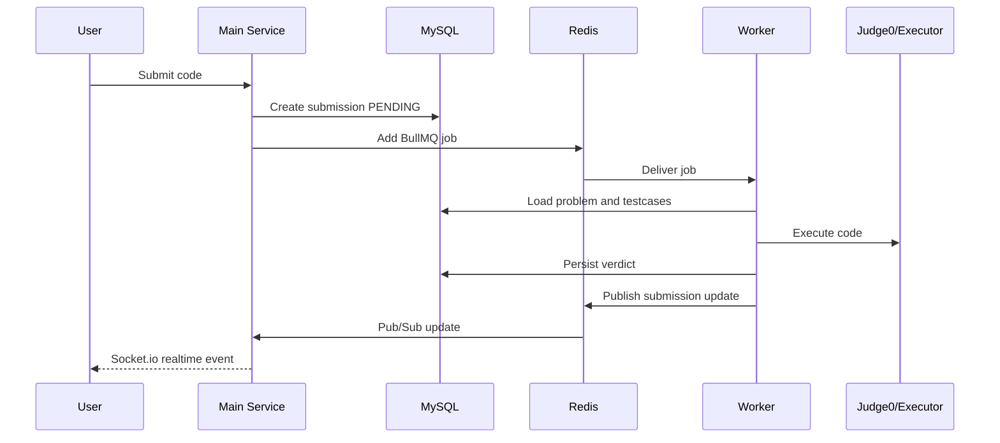

# Online Code Judge (OCJ)

OCJ is a TypeScript monorepo for an online judge platform. It focuses on a clean backend story for resume/interview discussion: authentication, problem/testcase management, async code judging, realtime match updates, custom rooms, comments, leaderboard, and a lightweight chatbox.

## Core Features

1. **Authentication & sessions**: register, login, refresh token, logout, revoke sessions, password reset.
2. **Problems & testcases**: CRUD problems, tags, starter code, time/memory limits, hidden/example testcases.
3. **Submissions & worker judging**: main-service stores submissions in MySQL, pushes jobs to BullMQ, and worker-service evaluates code.
4. **Realtime matches**: Socket.io matchmaking, custom rooms, match status updates, and ELO updates.
5. **Leaderboard & profile stats**: user rankings, streak/activity data, badges and tag stats.
6. **Comments**: nested comments/replies/likes for problem discussions.
7. **Chatbox**: lightweight chat sessions/messages kept separate from the removed AI roadmap/interview flows.

## Tech Stack

- **Monorepo**: npm workspaces + Turborepo
- **Frontend**: React, Vite, Monaco Editor, Socket.io Client
- **API**: Node.js, Express, TypeScript, Prisma
- **Database**: MySQL only
- **Queue/cache/realtime bridge**: Redis, BullMQ, Redis Pub/Sub
- **Worker**: BullMQ worker + `@ocj/executor` / Judge0-compatible execution
- **Realtime**: Socket.io

## Quick Start

```bash
npm install
npm run dev
```

`npm run dev` is the default hybrid flow. It starts MySQL and Redis with Docker Compose, generates Prisma Client, pushes the Prisma schema to MySQL, builds shared packages, then runs frontend, main-service, and worker-service locally.

Useful scripts:

```bash
npm run dev          # same as dev:hybrid
npm run dev:hybrid   # MySQL + Redis in Docker, apps local
npm run dev:docker   # everything in Docker
npm run dev:prepare  # generate Prisma, db push, build shared packages
npm run seed         # optional local seed data
```

Default local URLs:

- Frontend: `http://localhost:5173`
- API: `http://localhost:6868`
- Swagger: `http://localhost:6868/api-docs`
- MySQL: `localhost:3307`
- Redis: `localhost:6379`

## Runtime Flow



## Docker

Hybrid infrastructure only:

```bash
docker compose up -d --remove-orphans --wait --wait-timeout 120 mysql redis
```

Full Docker stack:

```bash
npm run dev:docker
```

Stop:

```bash
docker compose down
```
