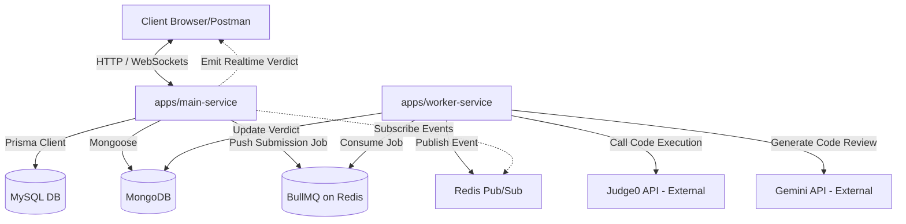

# Kế hoạch triển khai chi tiết (Implementation Plan) — Hệ thống Backend OCJ (2 Services)

Tài liệu này mô tả chi tiết phương án triển khai phần Backend của hệ thống Online Code Judge (OCJ) được tinh gọn với **2 services** (`main-service` và `worker-service`), sử dụng **MySQL (Prisma)**, **MongoDB (Mongoose)**, **Redis (ioredis/BullMQ)**, **Judge0 API**, và **Gemini API** (`@google/generative-ai`).

---

## 📂 1. Kiến trúc hệ thống (System Architecture)



1. **`main-service` (Express & Socket.io)**: Expose cổng REST API và cổng WebSocket ra ngoài. Kết nối trực tiếp đến MySQL (để kiểm tra thông tin User, Auth, Match) và MongoDB (Problems).
2. **`worker-service` (BullMQ Worker)**: Chạy ngầm, không mở cổng HTTP. Kết nối với Redis để rút job nộp bài, chấm qua Judge0, xin nhận xét từ Gemini, cập nhật lại MongoDB và phát tín hiệu Pub/Sub.

---

## 🗄️ 2. Thiết kế Cơ sở Dữ liệu (Simplified DB Schemas)

### A. MySQL Schema (Prisma)
Cập nhật file `apps/main-service/prisma/schema.prisma` với cấu trúc tinh gọn như sau:

```prisma
// Cập nhật User model (Thêm các trường phục vụ game & streak)
model User {
  id             String     @id @default(uuid()) @db.VarChar(36)
  username       String     @unique @db.VarChar(50)
  email          String     @unique @db.VarChar(255)
  password_hash  String?    @db.VarChar(255)
  avatar_url     String?    @db.VarChar(500)
  role           Role       @default(USER)
  elo_rating     Int        @default(1200)   // Điểm Elo chính
  streak_count   Int        @default(0)      // Số ngày làm bài liên tục hiện tại
  max_streak     Int        @default(0)      // Kỷ lục streak
  last_active_date DateTime? @db.Date         // Ngày cuối cùng làm bài để tính streak
  code_coins     Int        @default(0)      // Điểm thưởng để đổi quà (nếu cần)
  created_at     DateTime   @default(now())
  updated_at     DateTime   @updatedAt
  
  refresh_tokens RefreshToken[]
  password_reset_tokens PasswordResetToken[]
  matches_as_p1  Match[]    @relation("Player1")
  matches_as_p2  Match[]    @relation("Player2")
  tag_stats      UserTagStat[]

  @@map("users")
}

// Bảng Match lưu lịch sử Solo 1vs1
model Match {
  id           String      @id @default(uuid()) @db.VarChar(36)
  player1_id   String      @db.VarChar(36)
  player2_id   String      @db.VarChar(36)
  problem_id   String      @db.VarChar(24) // Lưu MongoDB ObjectId dưới dạng String
  winner_id    String?     @db.VarChar(36) // NULL = Draw (Hoà) hoặc Chưa kết thúc
  status       MatchStatus @default(PENDING)
  player1_status PlayerMatchStatus @default(CODING)
  player2_status PlayerMatchStatus @default(CODING)
  created_at   DateTime    @default(now())
  updated_at   DateTime    @updatedAt

  player1      User        @relation("Player1", fields: [player1_id], references: [id], onDelete: Cascade)
  player2      User        @relation("Player2", fields: [player2_id], references: [id], onDelete: Cascade)

  @@map("matches")
}

enum MatchStatus {
  PENDING
  RUNNING
  FINISHED
  DRAW
}

enum PlayerMatchStatus {
  CODING
  SUBMITTED_WA
  ACCEPTED
}

// Thư viện các thẻ thuật toán (phục vụ AI Roadmap)
model Tag {
  id          String        @id @default(uuid()) @db.VarChar(36)
  name        String        @unique @db.VarChar(100)
  slug        String        @unique @db.VarChar(100)
  color       String?       @db.VarChar(7) // mã màu hex, ví dụ: #FF5733
  user_stats  UserTagStat[]
  problems    ProblemIndexTag[]

  @@map("tags")
}

// Bảng thống kê số bài đã giải của User theo Tag (Đầu vào cho AI Roadmap)
model UserTagStat {
  user_id         String    @db.VarChar(36)
  tag_id          String    @db.VarChar(36)
  problems_solved Int       @default(0)

  user            User      @relation(fields: [user_id], references: [id], onDelete: Cascade)
  tag             Tag       @relation(fields: [tag_id], references: [id], onDelete: Cascade)

  @@share_pk PK_User_Tag [user_id, tag_id] // Composite PK
  @@id([user_id, tag_id])
  @@map("user_tag_stats")
}

// Index tối giản của Problems từ MongoDB sang MySQL để lọc & gán Tag
model ProblemIndex {
  mongo_problem_id String   @id @db.VarChar(24) // ObjectId của MongoDB
  title            String   @db.VarChar(255)
  slug             String   @unique @db.VarChar(255)
  difficulty       Difficulty
  created_at       DateTime @default(now())

  tags             ProblemIndexTag[]

  @@map("problem_index")
}

model ProblemIndexTag {
  mongo_problem_id String @db.VarChar(24)
  tag_id           String @db.VarChar(36)

  problem          ProblemIndex @relation(fields: [mongo_problem_id], references: [mongo_problem_id], onDelete: Cascade)
  tag              Tag          @relation(fields: [tag_id], references: [id], onDelete: Cascade)

  @@id([mongo_problem_id, tag_id])
  @@map("problem_index_tags")
}

enum Difficulty {
  EASY
  MEDIUM
  HARD
}
```

### B. MongoDB Schema (Mongoose)
Kết nối chung đến 1 DB MongoDB duy nhất (ví dụ: `ocj_database`).

#### 1. Collection `problems` (Đề bài & Lời giải mẫu, gộp chung Editorial)
```json
{
  "_id": "ObjectId",
  "title": "String",                  // VD: "Two Sum"
  "slug": "String",                   // unique index, VD: "two-sum"
  "description": "String",            // Nội dung đề bài dạng Markdown
  "difficulty": "String",             // "EASY" | "MEDIUM" | "HARD"
  "timeLimit": "Number",              // Giới hạn thời gian (ms), mặc định: 2000
  "memoryLimit": "Number",            // Giới hạn bộ nhớ (MB), mặc định: 256
  "starterCodes": {
    "cpp": "String",                  // Code mẫu khởi tạo
    "java": "String",
    "python": "String"
  },
  "editorialMarkdown": "String",       // Bài viết giải thích (gộp thẳng vào đây)
  "editorialVideoUrl": "String",       // Link video giải thích (nếu có)
  "createdAt": "Date",
  "updatedAt": "Date"
}
```

#### 2. Collection `testcases` (Bộ test để chấm)
```json
{
  "_id": "ObjectId",
  "problemId": "ObjectId",            // Ref tới collection problems
  "isExample": "Boolean",             // true = hiển thị trên đề bài cho user xem thử
  "input": "String",                  // Input chuẩn, VD: "2 7 11 15\n9"
  "output": "String"                  // Output mong đợi, VD: "0 1"
}
```
*Index:* `{ problemId: 1 }` để query nhanh toàn bộ testcase của bài.

#### 3. Collection `submissions` (Bài nộp của user)
```json
{
  "_id": "ObjectId",
  "userId": "String",                 // UUID của User từ MySQL
  "problemId": "ObjectId",            // Ref tới problems
  "code": "String",                   // Source code người dùng nộp
  "language": "String",               // "cpp" | "java" | "python"
  "status": "String",                 // "PENDING" | "PROCESSING" | "ACCEPTED" | "WA" | "TLE" | "MLE" | "RE" | "CE"
  "executionTime": "Number",          // ms (thời gian chạy lớn nhất trong các testcase)
  "memoryUsed": "Number",             // KB (bộ nhớ sử dụng lớn nhất)
  "errorMessage": "String",           // Chi tiết lỗi khi compile (CE) hoặc runtime (RE)
  "testCasesPassed": "Number",        // Số lượng testcase chạy đúng
  "testCasesTotal": "Number",         // Tổng số testcase ẩn
  "aiFeedback": "String",             // Nội dung nhận xét, tối ưu hoá code từ Gemini
  "createdAt": "Date"
}
```
*Index:* `{ userId: 1, createdAt: -1 }` (xem lịch sử user), `{ problemId: 1 }` (thống kê bài).

---

## 🔄 3. Cơ chế giao tiếp (Queue & Realtime Flow)

### A. BullMQ Queue trên Redis
*   Tên Queue: `submission_queue`
*   **Producer (`main-service`)**:
    *   Khi user nộp bài, `main-service` đẩy job vào `submission_queue` với payload:
        ```typescript
        interface SubmissionJobPayload {
          submissionId: string; // MongoDB ObjectId
          code: string;
          language: 'cpp' | 'java' | 'python';
          problemId: string;
        }
        ```
*   **Consumer (`worker-service`)**:
    *   Lắng nghe queue, lấy job ra chấm bài.

### B. Redis Pub/Sub (Realtime Verdict)
*   Tên Channel: `submission_verdict`
*   Sau khi `worker-service` hoàn thành chấm và cập nhật DB, nó sẽ publish một event JSON lên channel này:
    ```json
    {
      "submissionId": "...",
      "userId": "...",
      "problemId": "...",
      "status": "ACCEPTED",
      "testCasesPassed": 20,
      "testCasesTotal": 20
    }
    ```
*   `main-service` đăng ký lắng nghe channel này. Khi nhận được event, nó sẽ:
    1.  Tìm Socket kết nối của `userId` đó và bắn sự kiện realtime (`submissionFinished`) về màn hình trình duyệt của user.
    2.  *(Nếu là đấu Solo 1vs1)*: Kiểm tra xem `Match` của phòng đấu đó đã kết thúc chưa, update kết quả trận đấu, phân định người thắng cuộc và bắn thông báo tới cả 2 người trong phòng.

---

## ⚡ 4. Tích hợp các API ngoài (External APIs Integration)

### A. Judge0 API Integration (Hệ thống chấm code)
Dự án sẽ giao tiếp trực tiếp với Judge0 API thông qua HTTP request.

*   **Bảng ánh xạ Ngôn ngữ và ID Judge0 (Constants):**
    *   `cpp` -> ID `54` (C++ GCC 9.2.0) hoặc `75` (C++ GCC 14.1.0)
    *   `java` -> ID `62` (Java OpenJDK 13.0.1) hoặc `91` (Java JDK 21)
    *   `python` -> ID `71` (Python 3.8.1) hoặc `92` (Python 3.12.0)
*   **Luồng chấm bài trong `worker-service`:**
    1.  Lấy danh sách các `testcases` ẩn của `problemId` từ MongoDB.
    2.  Gửi request POST tới Judge0 API endpoint `/submissions/batch` để submit đồng thời toàn bộ testcases.
        *   *Body format:*
            ```json
            {
              "submissions": [
                {
                  "language_id": 71,
                  "source_code": "base64_encoded_code",
                  "stdin": "base64_encoded_input",
                  "expected_output": "base64_encoded_output",
                  "cpu_time_limit": 2.0, // lấy từ timeLimit của Problem
                  "memory_limit": 262144 // KB (256MB) lấy từ memoryLimit
                },
                ...
              ]
            }
            ```
    3.  Nhận về một mảng danh sách `tokens` từ Judge0.
    4.  Tiến hành **Polling** (gọi GET `/submissions/batch?tokens=t1,t2...&base64_encoded=true` định kỳ mỗi 1 giây) cho đến khi toàn bộ tokens có status khác `Queue` và `Processing`.
    5.  Tính toán kết quả cuối cùng:
        *   Nếu tất cả đều trả về `status.id = 3` (Accepted): Verdict = `ACCEPTED`.
        *   Nếu có testcase lỗi: Lấy lỗi đầu tiên gặp phải (Ví dụ: `id = 4` -> `Wrong Answer`, `id = 5` -> `Time Limit Exceeded`, `id = 6` -> `Compilation Error`, `id = 7..12` -> `Runtime Error`).
        *   Lấy ra `time` cao nhất và `memory` lớn nhất trong các testcase để hiển thị.

### B. Gemini API (`@google/generative-ai`)
Sử dụng SDK chính thức của Google để tích hợp AI.

```typescript
import { GoogleGenAI } from '@google/generative-ai';
const ai = new GoogleGenAI({ apiKey: process.env.GEMINI_API_KEY });
const model = ai.getGenerativeModel({ model: 'gemini-1.5-flash' });
```

#### 1. Đánh giá mã nguồn (AI Code Review):
*   Được chạy bất đồng bộ trong `worker-service` sau khi có kết quả từ Judge0 để giảm độ trễ cho user.
*   **System Prompt:** 
    > *"Bạn là một chuyên gia phỏng vấn kỹ thuật thuật toán tại các tập đoàn lớn. Nhiệm vụ của bạn là nhận xét đoạn code giải thuật DSA sau. Hãy nhận xét ngắn gọn, chỉ ra độ phức tạp thời gian (Time Complexity) và không gian (Space Complexity) thực tế của code, và gợi ý tối ưu nếu có. KHÔNG cung cấp code giải trực tiếp mà chỉ đưa ra gợi ý tư duy."*

#### 2. Đánh giá trình độ & Sinh lộ trình học (AI Roadmap Generator):
*   User sẽ hoàn thành bài Quiz nhanh trên Frontend. Backend `main-service` nhận kết quả trả lời + Elo hiện tại + Thống kê các bài toán đã giải theo Tag từ MySQL bảng `user_tag_stats`.
*   Backend gọi Gemini API với yêu cầu trả về cấu trúc **JSON cố định** để Frontend tự vẽ giao diện.
*   **Prompt yêu cầu định dạng JSON:**
    ```json
    {
      "roadmapTitle": "Lộ trình cải thiện cấu trúc dữ liệu và giải thuật cho User A",
      "targetLevel": "INTERMEDIATE",
      "steps": [
        {
          "week": 1,
          "topic": "Mảng và Con trỏ (Arrays & Pointers)",
          "why": "Vì kết quả đánh giá cho thấy bạn chưa tối ưu được bộ nhớ khi xử lý mảng tĩnh.",
          "recommendedProblems": ["two-sum", "move-zeroes"],
          "geminiAdvice": "Tập trung giải thuật 2 con trỏ để tối ưu thời gian về O(N)."
        },
        ...
      ]
    }
    ```

---

## ⚔️ 5. Luồng Đấu Solo 1vs1 Realtime (Matchmaking & Game Loop)

Để xây dựng game loop mượt mà, ta sử dụng **Redis ZSET** và **Socket.io** trong `main-service`:

### A. Redis Matchmaking Queue
*   **Hàng chờ tìm trận:** Lưu trong Redis Sorted Set với key `matchmaking_queue`.
    *   `member`: `userId`
    *   `score`: `elo_rating` của user
*   **Quy trình tìm trận:**
    1.  User nhấn "Tìm trận" -> Client gửi event `joinQueue` qua socket.
    2.  `main-service` thêm `userId` vào `matchmaking_queue` bằng lệnh `ZADD`.
    3.  Chạy một Cron/Interval lặp lại mỗi **2 giây**:
        *   Với mỗi user trong Queue, tìm các user khác có điểm Elo lệch không quá $\pm 100$ điểm bằng lệnh `ZRANGEBYSCORE matchmaking_queue (userElo - 100) (userElo + 100)`.
        *   Nếu tìm thấy đối thủ, gỡ cả 2 khỏi queue bằng `ZREM`, tạo một bản ghi `Match` mới trong MySQL với trạng thái `RUNNING` và một đề bài DSA ngẫu nhiên thích hợp với tầm Elo của họ.
        *   Gửi socket thông báo `matchFound` kèm `matchId` và đề bài tới cả 2 client.
        *   Hai client tự động join vào room socket tên `match:<matchId>`.

### B. Trạng thái phòng đấu realtime (Lưu ở Redis Hash)
Trong quá trình thi đấu, trạng thái phòng được cập nhật realtime qua Redis Hash `match_state:<matchId>` để đảm bảo tốc độ đọc/ghi siêu nhanh:
*   `player1_id`: UUID
*   `player2_id`: UUID
*   `player1_status`: `CODING` | `SUBMITTED_WA` | `ACCEPTED`
*   `player2_status`: `CODING` | `SUBMITTED_WA` | `ACCEPTED`

*   **Sự kiện realtime khi làm bài:**
    *   Khi người chơi gõ code, họ gửi event `codeChange` qua socket -> Backend phát lại (broadcast) cho đối thủ để hiển thị màn hình đối thủ đang gõ code.
    *   Khi người chơi nộp bài:
        *   Code được gửi lên chấm qua luồng Queue bất đồng bộ thông thường.
        *   Nếu kết quả chấm bài là **ACCEPTED**:
            *   Backend cập nhật trạng thái người chơi đó trong Redis Hash thành `ACCEPTED`.
            *   Phát sự kiện socket báo người đó đã AC.
            *   Nếu là người AC đầu tiên: Người đó thắng trận đấu. Cập nhật `Match` MySQL `winner_id = userId`, cộng $\approx 30$ Elo cho người thắng, trừ $\approx 25$ Elo người thua, kết thúc trận đấu và giải phóng phòng.

