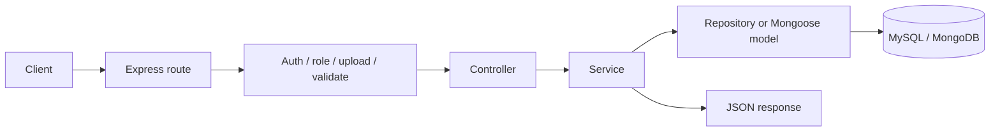

# API Overview

Main service expose REST API qua Express. Base path chung:

```text
/api/v1
```

Swagger UI duoc mount tai:

```text
/api-docs
```

Route prefixes duoc khai bao trong `packages/constants/src/index.ts` va register trong `apps/main-service/src/app.ts`.

## Route Modules

| Prefix | Route file | Module |
| --- | --- | --- |
| `/api/v1/auth` | `auth.route.ts` | Dang ky, dang nhap, refresh token, logout, session revoke, password reset. |
| `/api/v1/users` | `user.route.ts` | Public profile, current user, avatar, admin user management, user stats. |
| `/api/v1/problems` | `problem.route.ts` | CRUD problem, testcase, tags, problem listing/detail. |
| `/api/v1/submissions` | `submission.route.ts` | Submit code, run code sandbox, list/detail submissions. |
| `/api/v1/ai` | `ai.route.ts` | DSA roadmap va AI feedback. |
| `/api/v1/leaderboard` | `leaderboard.route.ts` | Bang xep hang. |
| `/api/v1/rooms` | `room.route.ts` | Custom competition rooms. |
| `/api/v1/matches` | `match_history.route.ts` | Lich su match. |
| `/api/v1/contests` | `contest.route.ts` | Contest, problem trong contest, registration, scoreboard. |
| `/api/v1/comments` | `comment.route.ts` | Comment/reply/like theo target. |
| `/api/v1/friends` | `friendship.route.ts` | Friend request, accept, block, list. |
| `/api/v1/shop` | `shop.route.ts` | Shop item, purchase, inventory, equip. |
| `/api/v1/notifications` | `notification.route.ts` | Tao/doc/mark-read/delete notification. |
| `/api/v1/reports` | `report.route.ts` | User report va admin moderation. |

## Common Request Flow



## Authentication Pattern

Protected routes dung middleware `requireAuth`:

```text
Authorization: Bearer <accessToken>
```

Admin routes dung them `requireAdmin`.

## Validation Pattern

Request validation dung `validateRequest(...)` voi Zod schemas trong `src/validators/*`.

Vi du:

- `auth.validator.ts`
- `submission.validator.ts`
- `problem.validator.ts`
- `contest.validator.ts`
- `room.validator.ts`

## Response Shape

Phan lon endpoint tra ve JSON theo pattern:

```json
{
  "status": "Success",
  "message": "Human readable message",
  "data": {}
}
```

Loi validation/auth/business logic duoc chuyen ve global error handler `error.middleware.ts`.

## API Documentation Sources

De xem chi tiet endpoint, request body va response:

1. Chay main service.
2. Mo `/api-docs`.
3. Hoac doc route files trong `apps/main-service/src/routes/*`.

Repo cung co `ocj_postman_collection.json` o root de import vao Postman.
