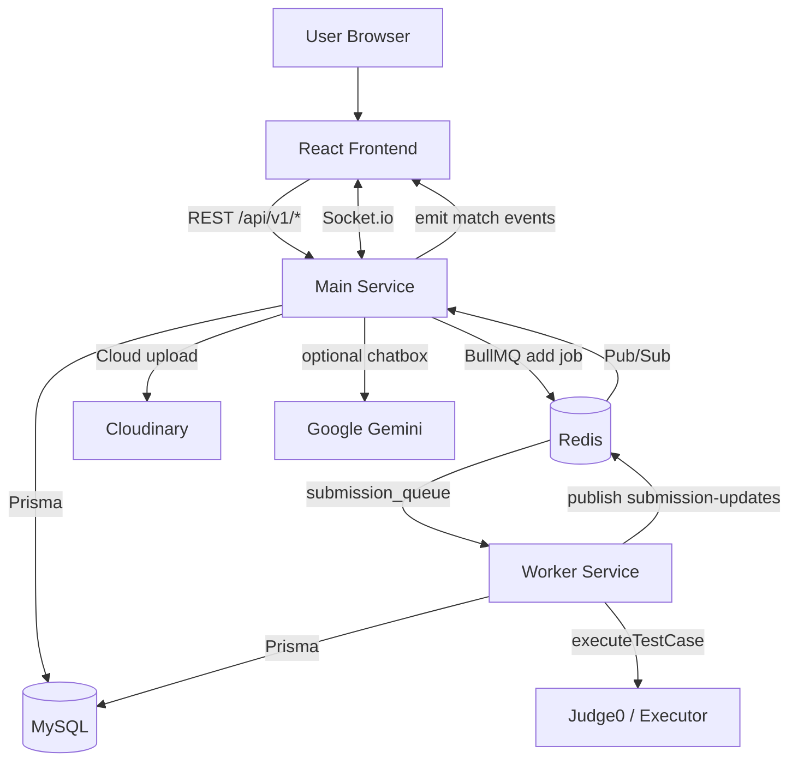

# Architecture

OCJ is an Online Code Judge made of a React client, an Express API service, an async judging worker, MySQL, and Redis.

## Main Components

| Component | Tech | Responsibility |
| --- | --- | --- |
| Frontend | React, Vite, Monaco Editor, Socket.io Client | Problem UI, submissions, rooms, rankings, admin surfaces. |
| Main Service | Node.js, Express, TypeScript | REST API, auth, business logic, Socket.io, queue producer. |
| Worker Service | Node.js, BullMQ Worker, Prisma | Pull submission jobs, run testcases, persist verdicts. |
| MySQL | MySQL 8, Prisma | Source of truth for users, problems, testcases, submissions, matches, rooms, comments, leaderboard data. |
| Redis | Redis 7, BullMQ, Pub/Sub | Submission queue, online user state, worker-to-main realtime updates. |
| Judge0/Executor | `@ocj/executor`, Judge0-compatible API | Execute submitted code by language and testcase. |
| Chatbox | Gemini API optional | Lightweight chat session/message flow. |
| Cloudinary | Cloudinary SDK | Avatar upload. |

## Runtime View



## Main Service Layers

```text
routes -> middlewares/validators -> controllers -> services -> repositories/config
```

- `routes`: endpoint and middleware declarations.
- `controllers`: request/response handling.
- `services`: business logic.
- `repositories`: Prisma/MySQL access where a module benefits from a repository boundary.
- `config`: Prisma, Redis, BullMQ queue, Cloudinary, env defaults.
- `middlewares`: auth, role checks, validation, upload, global error handling.

## Data Storage Strategy

MySQL is the only application database. Prisma models store problem statements, starter code, testcase IO, submission code/result, users, rooms, matches, comments, and supporting profile/ranking data.

This keeps the project easier to operate and easier to explain in interviews: one transactional source of truth, one ORM, and fewer cross-database consistency questions.

## Async Execution Strategy

The API never judges code inside the HTTP request. Main-service creates a `PENDING` submission in MySQL, pushes a BullMQ job to Redis, and returns quickly. Worker-service loads the problem and testcases from MySQL, runs them through the executor/Judge0 adapter, then updates the same submission row with the final verdict.

## Realtime Strategy

Socket.io server lives in main-service:

- Authenticates sockets with access tokens.
- Joins users to `user:{userId}` rooms.
- Holds the in-memory matchmaking queue.
- Uses `match:{matchId}` and `custom-room:{roomCode}` rooms.
- Receives worker verdicts through Redis Pub/Sub and emits realtime match/submission events.

## Deployment View

Docker Compose currently runs 5 services:

```text
frontend      -> port 5173:5173
mysql         -> port 3307:3306
redis         -> port 6379:6379
main-service  -> port 6868:6868
worker-service
```

Persistent volumes:

```text
mysql_data
redis_data
frontend_node_modules
```
