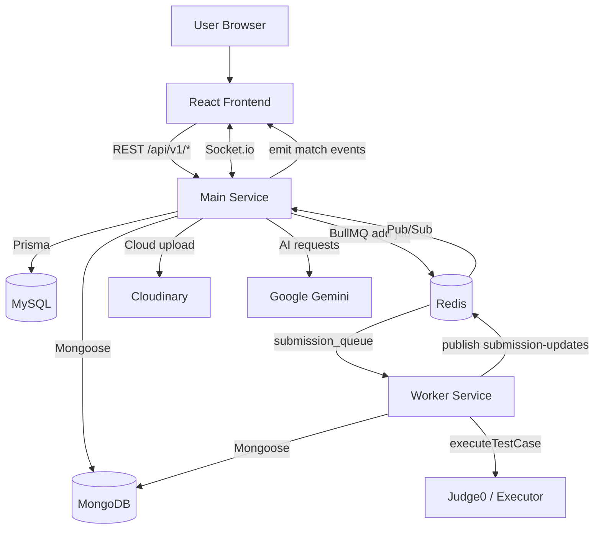

# Architecture

OCJ la he thong Online Code Judge gom client React, API service Express, worker cham bai bat dong bo, MySQL, MongoDB, Redis va cac tich hop ngoai.

## Thanh phan chinh

| Thanh phan | Cong nghe | Vai tro |
| --- | --- | --- |
| Frontend | React, Vite, Monaco Editor, Socket.io Client | UI nop bai, xem bai tap, phong dau, ranking, shop, admin. |
| Main Service | Node.js, Express, TypeScript | REST API, auth, business logic, Socket.io, queue producer. |
| Worker Service | Node.js, BullMQ Worker | Lay job submission, chay testcases, cap nhat verdict. |
| MySQL | MySQL 8, Prisma | Du lieu relational: user, auth token, ELO, match, contest, shop, social. |
| MongoDB | MongoDB 6, Mongoose | Du lieu document/lon: problem detail, testcase, submission code/result. |
| Redis | Redis 7, BullMQ, Pub/Sub | Queue job cham bai, online user set, submission realtime pub/sub. |
| Judge0/Executor | `@ocj/executor`, Judge0 API | Thuc thi code theo ngon ngu va testcase. |
| AI | Google Gemini API | Roadmap hoc DSA va feedback submission. |
| Cloudinary | Cloudinary SDK | Upload avatar/assets. |

## Runtime View



## Main Service Layers

Main service di theo huong Repository-Service-Controller:

```text
routes -> middlewares/validators -> controllers -> services -> repositories/models/config
```

- `routes`: khai bao endpoint va middleware theo module.
- `controllers`: nhan request/response, goi service.
- `services`: business logic.
- `repositories`: thao tac Prisma/MySQL theo module.
- `models`: Mongoose model cho MongoDB.
- `config`: ket noi Prisma, MongoDB, Redis, BullMQ queue, Cloudinary.
- `middlewares`: auth, role, validate request, upload, global error handler.

## Data Storage Strategy

He thong tach data theo tinh chat:

- MySQL/Prisma cho du lieu can quan he ro, constraint, unique, transaction: user, token, contest, match, friendship, shop, notification, report.
- MongoDB/Mongoose cho du lieu document co kich thuoc lon/linh hoat: problem statement, starter code, testcase input/output, submission code/result.

## Async Execution Strategy

Submission khong cham truc tiep trong HTTP request. Main service tao submission `PENDING`, day job vao BullMQ `submission_queue`, worker xu ly rieng, cap nhat MongoDB va publish ket qua ve Redis channel `submission-updates`.

## Realtime Strategy

Socket.io server nam trong main-service:

- Xac thuc socket bang access token.
- Join user vao room rieng `user:{userId}`.
- Matchmaking queue nam trong memory cua main-service.
- Match room co ten `match:{matchId}`.
- Custom room co ten `custom-room:{roomCode}`.
- Redis Pub/Sub giup worker bao ket qua submission ve main-service de emit socket event.

## Deployment View

Docker Compose hien tai chay 5 service:

```text
mysql         -> port 3307:3306
mongodb       -> port 27017:27017
redis         -> port 6379:6379
main-service  -> port 6868:6868
worker-service
```

Moi database co volume rieng: `mysql_data`, `mongo_data`, `redis_data`.
