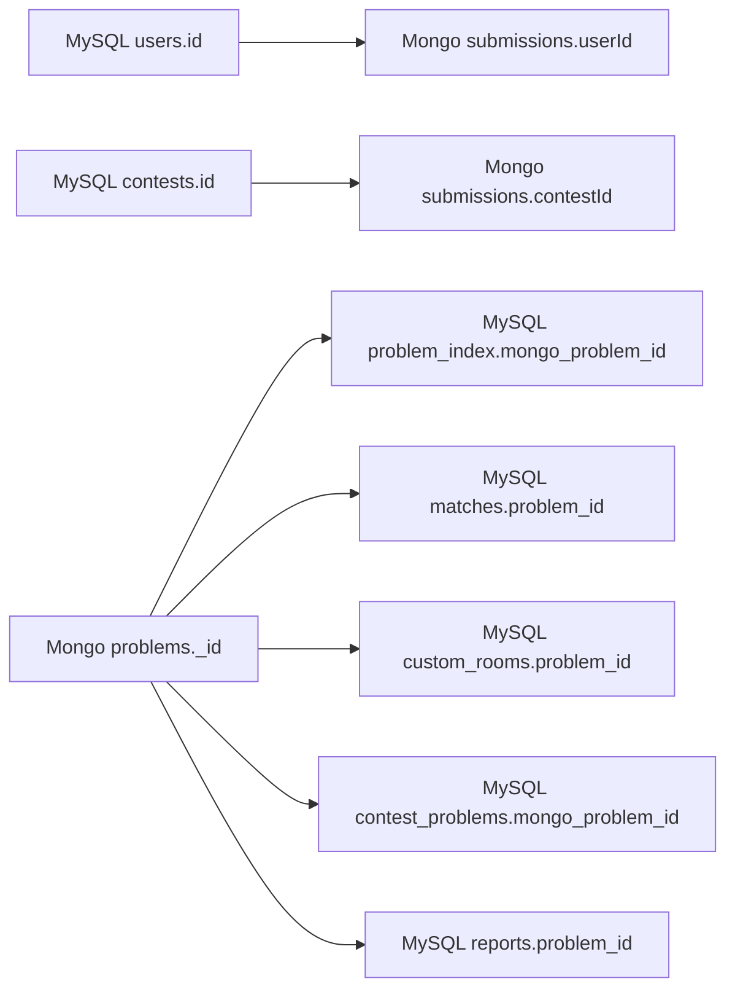

# Database Boundaries

OCJ dung ca MySQL va MongoDB. Viec tach database giup he thong vua co relational consistency cho user/social/contest, vua co document storage linh hoat cho code judge content.

## Rule Of Thumb

| Neu data... | Nen nam o | Ly do |
| --- | --- | --- |
| Can unique constraint, transaction, relation nhieu bang | MySQL/Prisma | User, token, match, contest, shop can constraint va query relational. |
| Co noi dung dai, linh hoat, document-like | MongoDB/Mongoose | Problem statement, starter code, testcase input/output, submission code. |
| Can query ranking/social/admin dashboard | MySQL/Prisma | De sort/filter/join on structured fields. |
| Can luu source code/result moi lan nop | MongoDB/Mongoose | Document lon, tang nhanh, khong can relational join chat. |

## MySQL Owns

- Identity: `users`, roles, ban status.
- Auth/session: refresh token, password reset token.
- Ranking and activity: ELO, streak, activity, badges, tag stats.
- Matchmaking records: matches, custom rooms.
- Contest metadata and registrations.
- Comment tree and likes.
- Social graph: friendship/block.
- Shop/inventory.
- Notification.
- Moderation report.
- Problem searchable index: `problem_index`, `tags`, `problem_index_tags`.

## MongoDB Owns

- Full problem document.
- Testcase input/output.
- Submission source code and verdict result.
- AI feedback attached to submission.

## Cross-Database References

## Consistency Notes

Vi MySQL va MongoDB khong co distributed transaction trong code hien tai, cac flow cross-database can duoc thiet ke theo huong application-level consistency.

### Problem create/update

Khi tao problem:

1. Tao document trong MongoDB `Problem`.
2. Tao index trong MySQL `ProblemIndex`.
3. Gan tag qua `ProblemIndexTag` neu co.

Neu buoc MySQL loi sau khi tao MongoDB, service nen rollback document MongoDB hoac co script reconcile.

### Problem delete

Khi xoa problem:

1. Xoa MongoDB `Problem`.
2. Xoa testcase/submission lien quan neu policy yeu cau.
3. Xoa MySQL `ProblemIndex` va `ProblemIndexTag`.
4. Kiem tra logical references trong match/contest/report/custom room truoc khi xoa neu can giu lich su.

### Submission create

Khi user nop bai:

1. Validate user tu auth token.
2. Validate problem ton tai trong MongoDB.
3. Tao MongoDB `Submission` voi status `PENDING`.
4. Day job vao BullMQ `submission_queue`.

Neu day queue loi sau khi tao submission, submission co the bi ket o `PENDING`; nen co retry/requeue job rieng neu can production hardening.

### Match result

Worker cap nhat submission trong MongoDB va publish Redis Pub/Sub. Main-service nghe update, tim MySQL `Match`, cap nhat winner/ELO bang Prisma transaction.

## Ownership Recommendations

- De MySQL la source of truth cho user, ranking, contest, social state.
- De MongoDB la source of truth cho problem content, testcase va submission details.
- Khong duplicate field lon tu MongoDB sang MySQL. Chi duplicate field index can query nhanh nhu title, slug, difficulty.
- Moi field cross-database nen duoc comment trong service hoac centralize helper validate de tranh mismatch.
