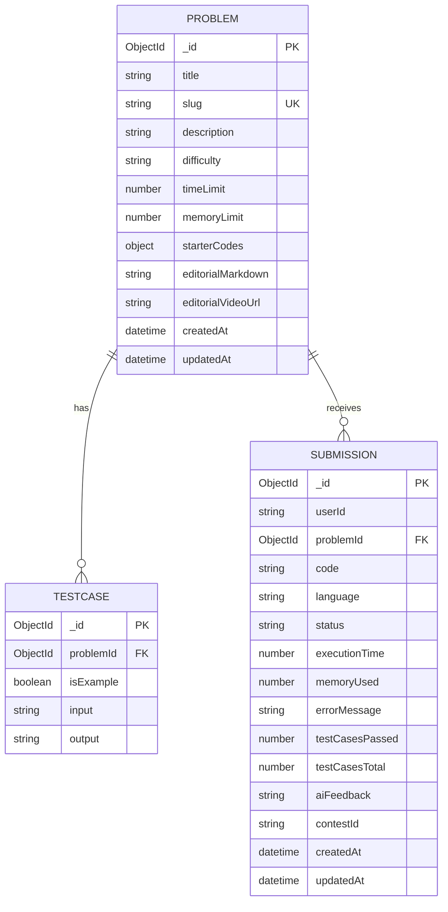

# MongoDB Mongoose Schemas

MongoDB duoc ket noi qua Mongoose trong `apps/main-service/src/config/mongoose.ts` va `apps/worker-service/src/config/mongoose.ts`. Cac model hien co nam o ca main-service va worker-service:

- `Problem`
- `Testcase`
- `Submission`

Hai service dung cung mot schema de main-service tao/quan ly du lieu, worker-service doc va cap nhat ket qua cham bai.

## Collections



## `Problem`

Source: `apps/main-service/src/models/problem.model.ts`

| Field | Type | Bat buoc | Ghi chu |
| --- | --- | --- | --- |
| `title` | String | Yes | Ten bai tap. |
| `slug` | String | Yes | Unique va indexed. |
| `description` | String | Yes | Noi dung de bai, co the dai. |
| `difficulty` | `EASY`/`MEDIUM`/`HARD` | Yes | Do kho. |
| `timeLimit` | Number | No | Default `DEFAULT_LIMITS.TIME_LIMIT_MS` = 2000. |
| `memoryLimit` | Number | No | Default `DEFAULT_LIMITS.MEMORY_LIMIT_MB` = 256. |
| `starterCodes.cpp` | String | No | Code mau C++. |
| `starterCodes.java` | String | No | Code mau Java. |
| `starterCodes.python` | String | No | Code mau Python. |
| `editorialMarkdown` | String | No | Loi giai dang Markdown. |
| `editorialVideoUrl` | String | No | URL video loi giai. |
| `createdAt`, `updatedAt` | Date | Auto | Do `timestamps: true`. |

## `Testcase`

Source: `apps/main-service/src/models/testcase.model.ts`

| Field | Type | Bat buoc | Ghi chu |
| --- | --- | --- | --- |
| `problemId` | ObjectId ref `Problem` | Yes | Indexed. |
| `isExample` | Boolean | No | Default `false`, phan biet testcase hien thi va testcase an. |
| `input` | String | Yes | Input truyen vao chuong trinh. |
| `output` | String | Yes | Output mong doi. |

## `Submission`

Source: `apps/main-service/src/models/submission.model.ts`

| Field | Type | Bat buoc | Ghi chu |
| --- | --- | --- | --- |
| `userId` | String | Yes | Logical reference den MySQL `users.id`, indexed. |
| `problemId` | ObjectId ref `Problem` | Yes | Indexed. |
| `code` | String | Yes | Source code user nop. |
| `language` | `cpp`/`java`/`python` | Yes | Theo `SUPPORTED_LANGUAGES`. |
| `status` | Enum | No | Default `PENDING`, indexed. |
| `executionTime` | Number | No | Tong thoi gian chay testcases da qua. |
| `memoryUsed` | Number | No | Max memory used. |
| `errorMessage` | String | No | Loi runtime/compile/wrong answer/time limit. |
| `testCasesPassed` | Number | No | Default `0`. |
| `testCasesTotal` | Number | No | Default `0`. |
| `aiFeedback` | String | No | Feedback tu AI. |
| `contestId` | String | No | Logical reference den MySQL `contests.id`, indexed. |
| `createdAt`, `updatedAt` | Date | Auto | Do `timestamps: true`. |

Status values:

```text
PENDING, PROCESSING, ACCEPTED, WA, TLE, MLE, RE, CE
```

## Indexes

| Collection | Index |
| --- | --- |
| `problems` | `slug` unique, indexed. |
| `testcases` | `problemId`. |
| `submissions` | `userId`, `problemId`, `status`, `contestId`. |

## MongoDB Usage By Service

| Service | Usage |
| --- | --- |
| Main service | CRUD problem/testcase, tao submission, doc submission history, AI feedback. |
| Worker service | Doc submission/problem/testcases, cap nhat verdict, publish realtime update. |

## Logical Links To MySQL

MongoDB khong enforce FK voi MySQL. Cac lien ket sau can duoc validate trong service:

- `Submission.userId` -> MySQL `users.id`
- `Submission.contestId` -> MySQL `contests.id`
- MySQL `problem_index.mongo_problem_id` -> MongoDB `problems._id`
- MySQL `matches.problem_id` -> MongoDB `problems._id`
- MySQL `custom_rooms.problem_id` -> MongoDB `problems._id`
- MySQL `contest_problems.mongo_problem_id` -> MongoDB `problems._id`
- MySQL `reports.problem_id` -> MongoDB `problems._id`
