# MySQL Prisma ERD

MySQL duoc quan ly bang Prisma tai `apps/main-service/prisma/schema.prisma`. Database nay luu cac thuc the relational: user, auth/session, ELO, tag index, match, custom room, contest, comment, friendship, shop, notification va report.

## ERD

```mermaid
erDiagram
  USER ||--o{ REFRESH_TOKEN : owns
  USER ||--o{ PASSWORD_RESET_TOKEN : owns
  USER ||--o{ MATCH : player1
  USER ||--o{ MATCH : player2
  USER ||--o{ USER_TAG_STAT : has
  USER ||--o{ USER_BADGE : earns
  USER ||--o{ ELO_HISTORY : has
  USER ||--o{ USER_ACTIVITY : has
  USER ||--o{ CUSTOM_ROOM : creates
  USER ||--o{ CUSTOM_ROOM : joins

  BADGE ||--o{ USER_BADGE : assigned
  TAG ||--o{ USER_TAG_STAT : counted_by
  TAG ||--o{ PROBLEM_INDEX_TAG : labels
  PROBLEM_INDEX ||--o{ PROBLEM_INDEX_TAG : indexed_as

  CONTEST ||--o{ CONTEST_PROBLEM : includes
  CONTEST ||--o{ CONTEST_REGISTRATION : has

  COMMENT ||--o{ COMMENT : replies
  COMMENT ||--o{ COMMENT_LIKE : receives

  SHOP_ITEM ||--o{ INVENTORY_ITEM : purchased_as

  USER {
    string id PK
    string username UK
    string email UK
    string password_hash
    string full_name
    string bio
    string avatar_url
    Role role
    int elo_rating
    int streak_count
    int max_streak
    date last_active_date
    int code_coins
    boolean is_banned
    datetime banned_at
    string banned_reason
    datetime created_at
    datetime updated_at
  }

  REFRESH_TOKEN {
    string id PK
    string token UK
    string user_id FK
    datetime expires_at
    string user_agent
    string ip_address
    datetime last_used_at
    boolean is_revoked
    datetime created_at
  }

  PASSWORD_RESET_TOKEN {
    string id PK
    string token UK
    string user_id FK
    datetime expires_at
    boolean used
    datetime created_at
  }

  BADGE {
    string id PK
    string name
    string slug UK
    string description
    string icon_url
    BadgeType type
    datetime created_at
  }

  USER_BADGE {
    string id PK
    string user_id FK
    string badge_id FK
    datetime earned_at
  }

  ELO_HISTORY {
    string id PK
    string user_id FK
    int old_elo
    int new_elo
    int change
    string reason
    string match_id
    datetime created_at
  }

  USER_ACTIVITY {
    string id PK
    string user_id FK
    date activity_date
    int submissions_count
    int problems_solved_count
  }

  MATCH {
    string id PK
    string player1_id FK
    string player2_id FK
    string problem_id
    string winner_id
    MatchStatus status
    PlayerMatchStatus player1_status
    PlayerMatchStatus player2_status
    datetime created_at
    datetime updated_at
  }

  TAG {
    string id PK
    string name UK
    string slug UK
    string color
  }

  USER_TAG_STAT {
    string user_id PK "FK users.id"
    string tag_id PK "FK tags.id"
    int problems_solved
  }

  PROBLEM_INDEX {
    string mongo_problem_id PK
    string title
    string slug UK
    Difficulty difficulty
    datetime created_at
  }

  PROBLEM_INDEX_TAG {
    string mongo_problem_id PK "FK problem_index.mongo_problem_id"
    string tag_id PK "FK tags.id"
  }

  CUSTOM_ROOM {
    string id PK
    string room_code UK
    string creator_id FK
    string opponent_id FK
    string problem_id
    Difficulty difficulty
    int time_limit
    int memory_limit
    CustomRoomStatus status
    string match_id
    datetime created_at
    datetime updated_at
  }

  CONTEST {
    string id PK
    string title
    string description
    datetime start_time
    datetime end_time
    datetime created_at
    datetime updated_at
  }

  CONTEST_PROBLEM {
    string contest_id PK "FK contests.id"
    string mongo_problem_id PK
    int points
    int order
  }

  CONTEST_REGISTRATION {
    string contest_id PK "FK contests.id"
    string user_id PK
    datetime registered_at
  }

  COMMENT {
    string id PK
    string target_id
    string target_type
    string user_id
    string content
    string parent_id FK
    datetime created_at
    datetime updated_at
  }

  COMMENT_LIKE {
    string comment_id PK "FK comments.id"
    string user_id PK
    datetime created_at
  }

  FRIENDSHIP {
    string id PK
    string sender_id
    string receiver_id
    FriendshipStatus status
    datetime created_at
    datetime updated_at
  }

  BLOCK {
    string blocker_id PK
    string blocked_id PK
    datetime created_at
  }

  SHOP_ITEM {
    string id PK
    string name
    string description
    int price
    string item_type
    string asset_url
    datetime created_at
    datetime updated_at
  }

  INVENTORY_ITEM {
    string id PK
    string user_id
    string item_id FK
    boolean is_equipped
    datetime acquired_at
  }

  NOTIFICATION {
    string id PK
    string user_id
    string title
    string content
    string type
    boolean is_read
    string data
    datetime created_at
  }

  REPORT {
    string id PK
    string user_id
    string reported_user_id
    string problem_id
    string type
    string content
    ReportStatus status
    datetime created_at
    datetime updated_at
  }
```

## Nhom bang

### Identity & Session

- `users`: tai khoan, profile, role, ELO, coin, ban status.
- `refresh_tokens`: refresh token/session theo thiet bi, co revoke.
- `password_reset_tokens`: token quen mat khau.

### Achievement & Activity

- `badges`, `user_badges`: badge va badge user da dat.
- `elo_histories`: lich su thay doi ELO.
- `user_activities`: activity theo ngay, dung cho streak/submission/solved count.

### Problem Index & Tags

- `problem_index`: ban index MySQL cua problem MongoDB, giup query/list/search theo relational fields.
- `tags`: tag metadata.
- `problem_index_tags`: many-to-many giua problem index va tag.
- `user_tag_stats`: so bai user da solve theo tag.

### Match & Room

- `matches`: tran 1v1, player1/player2, problem Mongo id, winner, status.
- `custom_rooms`: phong custom, creator/opponent, problem Mongo id, status.

### Contest

- `contests`: contest metadata.
- `contest_problems`: danh sach problem Mongo id trong contest, diem va thu tu.
- `contest_registrations`: user dang ky contest.

### Discussion

- `comments`: comment/reply theo `target_id` va `target_type`.
- `comment_likes`: like cua user tren comment.

### Social

- `friendships`: friend request va accepted friendship.
- `blocks`: user block user.

### Shop & Notification

- `shop_items`: item ban trong shop.
- `inventory_items`: item user da mua/trang bi.
- `notifications`: notification theo user, co JSON/text `data`.

### Moderation

- `reports`: bao cao bug, typo, cheating, noi dung xau hoac cac loai khac.

## Luu y ve quan he logical

Mot so field la logical reference nhung Prisma schema hien tai khong khai bao `@relation`:

- `Match.problem_id` tro den MongoDB `Problem._id`.
- `ContestProblem.mongo_problem_id` tro den MongoDB `Problem._id`.
- `CustomRoom.problem_id` tro den MongoDB `Problem._id`.
- `Report.problem_id` tro den MongoDB `Problem._id`.
- `Submission.userId` trong MongoDB tro den MySQL `User.id`.
- `Submission.contestId` trong MongoDB tro den MySQL `Contest.id`.
- `Friendship.sender_id`, `Friendship.receiver_id`, `Block.blocker_id`, `Block.blocked_id`, `Notification.user_id`, `InventoryItem.user_id`, `Comment.user_id`, `CommentLike.user_id`, `ContestRegistration.user_id` ve logic deu tro den `User.id`, nhung Prisma schema chua khai bao foreign key relation.

Khi viet service, can validate cac logical reference nay o application layer.
