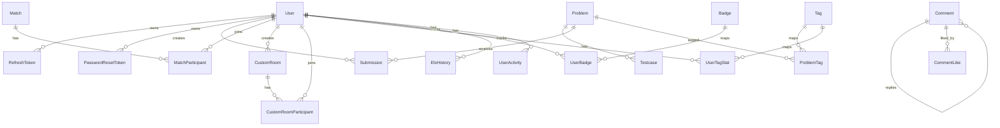

# MySQL / Prisma ERD

Prisma schema lives at:

```text
apps/main-service/prisma/schema.prisma
```

MySQL is the only application database. Problem content, testcases, submissions, users, matches, rooms, comments, and profile/ranking data all live behind Prisma.

## Core ERD



## Important Tables

| Table | Purpose |
| --- | --- |
| `users` | Account identity, role, ELO, streak, avatar/profile fields. |
| `refresh_tokens` | Session refresh tokens with revoke/expiry state. |
| `password_reset_tokens` | Password reset flow tokens. |
| `problems` | Problem statement, slug, difficulty, limits, starter code, editorial fields. |
| `testcases` | Input/output pairs for a problem, with `is_example` flag. |
| `submissions` | User code, language, verdict, runtime/memory, testcase pass counts. |
| `tags` / `problem_tags` | Problem taxonomy. |
| `matches` / `match_participants` | 1v1/custom match state and participant results. |
| `custom_rooms` / `custom_room_participants` | User-created room setup and ready/join state. |
| `comments` / `comment_likes` | Discussion threads attached to targets such as problems. |
| `elo_histories`, `user_activities`, `user_tag_stats`, `badges`, `user_badges` | Profile, gamification, and ranking support. |

## Problem / Submission Model

```text
Problem
  id                  uuid
  title               varchar(255)
  slug                unique varchar(255)
  description         text
  difficulty          EASY | MEDIUM | HARD
  time_limit          int
  memory_limit        int
  starter_code_cpp    text
  starter_code_java   text
  starter_code_python text

Submission
  id                 uuid
  user_id            FK users.id
  problem_id         FK problems.id
  code               longtext
  language           cpp | java | python
  status             PENDING | PROCESSING | ACCEPTED | WA | TLE | MLE | RE | CE
  execution_time     float?
  memory_used        int?
  error_message      text?
  test_cases_passed  int
  test_cases_total   int
```

## Removed Scope

The Prisma schema intentionally excludes contest, social/friendship, shop, notification, report/moderation, AI roadmap/debug, and news tables in the current simplified scope.
