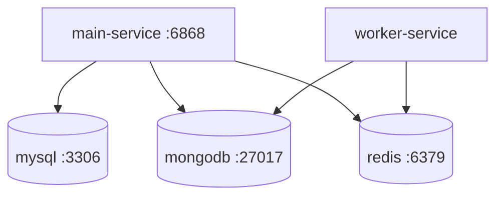

# Deployment

Repo hien co Docker Compose va script ho tro VPS:

- `docker-compose.yml`
- `.env.docker.example`
- `deploy-vps.sh`
- `setup_vps.sh`

## Docker Compose Services



| Service | Image/Build | Container | Port |
| --- | --- | --- | --- |
| `mysql` | `mysql:8.0` | `ocj_mysql` | `3307:3306` |
| `mongodb` | `mongo:6.0` | `ocj_mongodb` | `27017:27017` |
| `redis` | `redis:7-alpine` | `ocj_redis` | `6379:6379` |
| `main-service` | build `apps/main-service/Dockerfile` | `ocj_main_service` | `6868:6868` |
| `worker-service` | build `apps/worker-service/Dockerfile` | `ocj_worker_service` | none exposed |

## Volumes

```text
mysql_data -> /var/lib/mysql
mongo_data -> /data/db
redis_data -> /data
```

Redis chay voi:

```text
redis-server --appendonly yes
```

## Health And Dependencies

`main-service` phu thuoc:

- MySQL healthy.
- MongoDB started.
- Redis started.

`worker-service` phu thuoc:

- MongoDB started.
- Redis started.

MySQL co healthcheck:

```text
mysqladmin ping -h localhost
```

## Deploy With Docker Compose

1. Tao env:

   ```bash
   cp .env.docker.example .env.docker
   ```

2. Dien secrets va connection config trong `.env.docker`.

3. Build va chay:

   ```bash
   docker compose up -d --build
   ```

4. Xem logs:

   ```bash
   docker compose logs -f main-service
   docker compose logs -f worker-service
   ```

5. Dung stack:

   ```bash
   docker compose down
   ```

## Environment Checklist

Truoc khi deploy production/staging, kiem tra:

- `DATABASE_URL` tro dung MySQL trong network Docker.
- `MONGO_URI` co username/password va `authSource` dung.
- `REDIS_HOST` la service name `redis` neu chay trong Docker network.
- JWT secrets khong dung default.
- Judge0/RapidAPI config san sang.
- Gemini API key neu bat AI.
- Cloudinary config neu bat upload avatar/assets.
- CORS origin neu can siet production.

## Database Migration

Prisma hien co migration folder:

```text
apps/main-service/prisma/migrations/
```

Trong Docker deploy nen dung Prisma migration workflow phu hop production, vi `db:push` tien cho dev nhung khong luu audit migration nhu `migrate deploy`.

## Production Notes

- Matchmaking queue hien dang in-memory trong main-service. Neu scale nhieu replica, can centralized queue/matchmaking.
- Socket.io khi scale nhieu instance can adapter Redis va sticky sessions/load balancer config.
- Worker concurrency hien la `2`; can tune theo CPU/RAM va Judge0 throughput.
- `removeOnFail: false` giup giu failed queue jobs de debug.
- Nen backup ca MySQL volume va MongoDB volume.
- Nen monitor Redis memory vi queue va Pub/Sub deu phu thuoc Redis.

## Public Endpoints

Neu deploy mac dinh:

```text
Main API: http://<host>:6868
Swagger:  http://<host>:6868/api-docs
```

Frontend deployment khong duoc khai bao trong root Docker Compose hien tai; neu can production frontend, can build `apps/frontend` va serve static bang Nginx/CDN hoac them service rieng.
