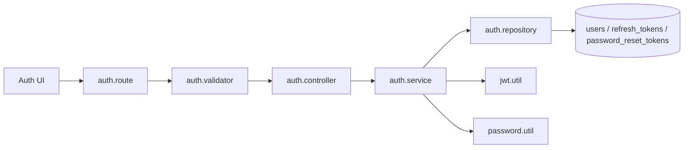
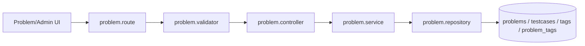
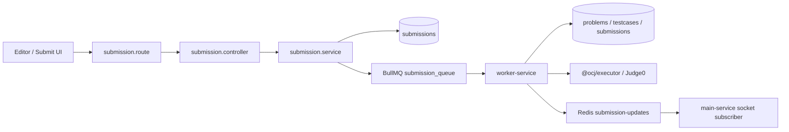
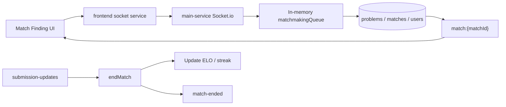
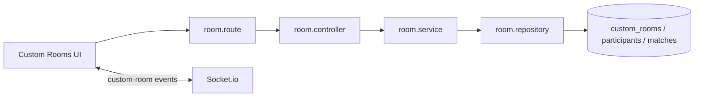
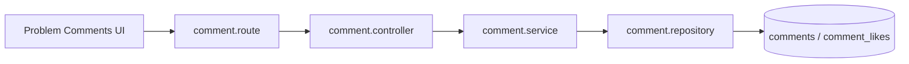
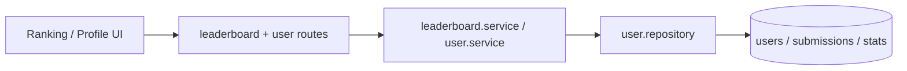
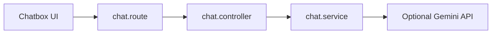

# Feature Flows

This file lists the main flows worth learning and explaining. The project is intentionally trimmed to a focused resume-friendly scope.

## 1. Authentication And Session

Users register/login, receive access + refresh tokens, and can revoke sessions.

Key files:

- `apps/main-service/src/routes/auth.route.ts`
- `apps/main-service/src/controllers/auth.controller.ts`
- `apps/main-service/src/services/auth.service.ts`
- `apps/main-service/src/repositories/auth.repository.ts`
- `apps/main-service/src/middlewares/auth.middleware.ts`

## 2. Problem And Testcase Management

Problems, tags, starter code, limits, and testcases are stored in MySQL through Prisma.

Key files:

- `apps/main-service/src/routes/problem.route.ts`
- `apps/main-service/src/controllers/problem.controller.ts`
- `apps/main-service/src/services/problem.service.ts`
- `apps/main-service/src/repositories/problem.repository.ts`
- `apps/main-service/src/validators/problem.validator.ts`
- `apps/main-service/prisma/schema.prisma`

## 3. Submit Code And Judge

Main-service creates a MySQL submission, queues a BullMQ job, and worker-service evaluates testcases asynchronously.

Key files:

- `apps/main-service/src/routes/submission.route.ts`
- `apps/main-service/src/controllers/submission.controller.ts`
- `apps/main-service/src/services/submission.service.ts`
- `apps/main-service/src/config/queue.ts`
- `apps/worker-service/src/workers/submission.worker.ts`
- `packages/executor/src/index.ts`

## 4. Realtime Matchmaking 1v1

Users join a Socket.io matchmaking queue. Main-service pairs close-ELO users, selects a MySQL problem, creates a match, and emits realtime match events.

Key files:

- `apps/main-service/src/sockets/socket.ts`
- `apps/main-service/src/sockets/matchmaking.ts`
- `apps/main-service/src/routes/match_history.route.ts`
- `apps/main-service/src/services/match_history.service.ts`
- `packages/utils/src/index.ts`

## 5. Custom Rooms

Users create rooms, join by code, ready up, and start a multiplayer match. Room state is persisted in MySQL and synchronized by Socket.io.

Key files:

- `apps/main-service/src/routes/room.route.ts`
- `apps/main-service/src/controllers/room.controller.ts`
- `apps/main-service/src/services/room.service.ts`
- `apps/main-service/src/repositories/room.repository.ts`
- `apps/main-service/src/sockets/socket.ts`

## 6. Comments And Discussions

Users can create, reply, update, delete, and like comments attached to a target such as a problem.

Key files:

- `apps/main-service/src/routes/comment.route.ts`
- `apps/main-service/src/controllers/comment.controller.ts`
- `apps/main-service/src/services/comment.service.ts`
- `apps/main-service/src/repositories/comment.repository.ts`

## 7. Leaderboard And User Stats

Leaderboard/profile data comes from users, ELO histories, activities, tag stats, and MySQL submissions.

Key files:

- `apps/main-service/src/routes/leaderboard.route.ts`
- `apps/main-service/src/services/leaderboard.service.ts`
- `apps/main-service/src/routes/user.route.ts`
- `apps/main-service/src/services/user.service.ts`
- `apps/main-service/src/repositories/user.repository.ts`

## 8. Chatbox

The remaining AI-related surface is a lightweight in-memory chatbox: list sessions and send messages to a session id. It can use Gemini when configured and should stay separate from judge verdict logic.

Key files:

- `apps/main-service/src/routes/chat.route.ts`
- `apps/main-service/src/controllers/chat.controller.ts`

## Removed From Current Learning Scope

The previous contest, social/friendship, shop, notification, report/moderation, AI roadmap/debug, news, and mock interview flows are no longer part of the active product surface.
