# Feature Flows

File nay liet ke cac luong chuc nang chinh trong OCJ, moi luong gom overview, so do va file lien quan de trace code nhanh.

## 1. Authentication And Session

Nguoi dung dang ky/dang nhap, nhan access token + refresh token. Refresh token duoc luu trong MySQL de revoke theo session.

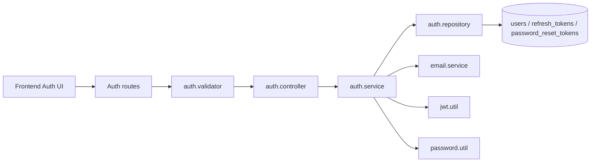

Files lien quan:

- `apps/frontend/src/components/auth/AuthModal.tsx`
- `apps/frontend/src/components/auth/AccountSettings.tsx`
- `apps/frontend/src/context/AuthContext.tsx`
- `apps/frontend/src/services/api.ts`
- `apps/main-service/src/routes/auth.route.ts`
- `apps/main-service/src/controllers/auth.controller.ts`
- `apps/main-service/src/services/auth.service.ts`
- `apps/main-service/src/repositories/auth.repository.ts`
- `apps/main-service/src/validators/auth.validator.ts`
- `apps/main-service/src/middlewares/auth.middleware.ts`
- `apps/main-service/src/utils/jwt.util.ts`
- `apps/main-service/src/utils/password.util.ts`
- `apps/main-service/src/services/email.service.ts`
- `apps/main-service/prisma/schema.prisma`

## 2. Problem And Testcase Management

Problem detail/testcase nam trong MongoDB. Problem index/tag nam trong MySQL de phuc vu list/filter/search va thong ke tag.

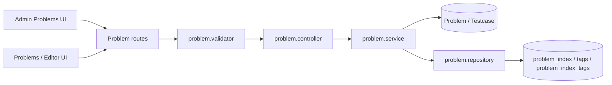

Files lien quan:

- `apps/frontend/src/views/SoloSolveView.tsx`
- `apps/frontend/src/views/PvPWorkspaceView.tsx`
- `apps/frontend/src/views/ContestSolveView.tsx`
- `apps/frontend/src/views/PlaygroundView.tsx`
- `apps/frontend/src/features/problems/ProblemsPage.tsx`
- `apps/frontend/src/components/admin/AdminProblemsTab.tsx`
- `apps/frontend/src/components/editor/ProblemDescription.tsx`
- `apps/frontend/src/components/editor/TestCaseSelector.tsx`
- `apps/frontend/src/components/editor/CodeEditorPane.tsx`
- `apps/frontend/src/components/editor/ConsolePane.tsx`
- `apps/main-service/src/routes/problem.route.ts`
- `apps/main-service/src/controllers/problem.controller.ts`
- `apps/main-service/src/services/problem.service.ts`
- `apps/main-service/src/repositories/problem.repository.ts`
- `apps/main-service/src/validators/problem.validator.ts`
- `apps/main-service/src/models/problem.model.ts`
- `apps/main-service/src/models/testcase.model.ts`
- `apps/main-service/prisma/schema.prisma`

## 3. Submit Code And Judge

Main-service tao submission trong MongoDB va day job vao Redis/BullMQ. Worker-service lay job, chay testcases qua executor/Judge0, cap nhat verdict va publish Redis Pub/Sub.

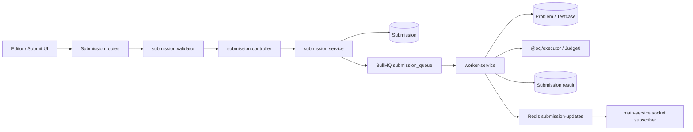

Files lien quan:

- `apps/frontend/src/views/SoloSolveView.tsx`
- `apps/frontend/src/views/PvPWorkspaceView.tsx`
- `apps/frontend/src/views/ContestSolveView.tsx`
- `apps/frontend/src/views/PlaygroundView.tsx`
- `apps/frontend/src/views/SubmissionsView.tsx`
- `apps/frontend/src/components/editor/CodeEditorPane.tsx`
- `apps/frontend/src/components/editor/ConsolePane.tsx`
- `apps/frontend/src/components/editor/ExecutionResultPanel.tsx`
- `apps/frontend/src/services/api.ts`
- `apps/main-service/src/routes/submission.route.ts`
- `apps/main-service/src/controllers/submission.controller.ts`
- `apps/main-service/src/services/submission.service.ts`
- `apps/main-service/src/validators/submission.validator.ts`
- `apps/main-service/src/config/queue.ts`
- `apps/main-service/src/models/submission.model.ts`
- `apps/main-service/src/models/problem.model.ts`
- `apps/main-service/src/models/testcase.model.ts`
- `apps/worker-service/src/workers/submission.worker.ts`
- `apps/worker-service/src/models/submission.model.ts`
- `apps/worker-service/src/models/problem.model.ts`
- `apps/worker-service/src/models/testcase.model.ts`
- `packages/executor/src/index.ts`
- `packages/constants/src/index.ts`

## 4. Realtime Matchmaking 1v1

User join matchmaking queue qua Socket.io. Main-service sort queue theo ELO, chon cap gan nhat, random problem MongoDB, tao MySQL match va emit `match-found`.

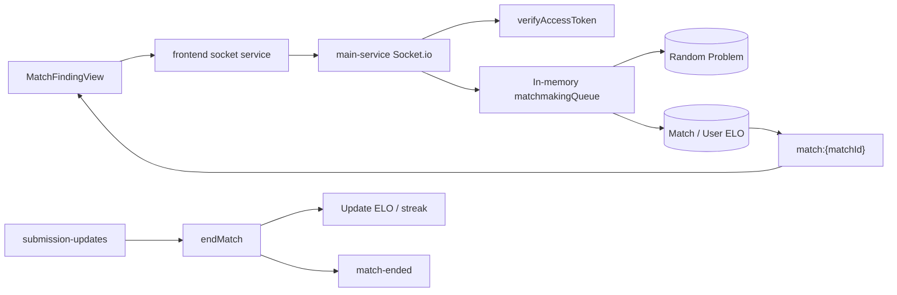

Files lien quan:

- `apps/frontend/src/views/MatchFindingView.tsx`
- `apps/frontend/src/components/match/FindingCircle.tsx`
- `apps/frontend/src/components/match/PlayerCard.tsx`
- `apps/frontend/src/components/editor/OpponentStatus.tsx`
- `apps/frontend/src/components/editor/MatchResultModal.tsx`
- `apps/frontend/src/services/socket.ts`
- `apps/main-service/src/server.ts`
- `apps/main-service/src/sockets/socket.ts`
- `apps/main-service/src/sockets/matchmaking.ts`
- `apps/main-service/src/routes/match_history.route.ts`
- `apps/main-service/src/controllers/match_history.controller.ts`
- `apps/main-service/src/services/match_history.service.ts`
- `apps/main-service/src/repositories/match_history.repository.ts`
- `packages/constants/src/index.ts`
- `packages/utils/src/index.ts`

## 5. Custom Rooms (Multiplayer Arena)

User tạo phòng custom, chọn số lượng người (2-10), config/problem/difficulty, mời hoặc chờ opponent tham gia. Socket room `custom-room:{roomCode}` dùng để sync room state.

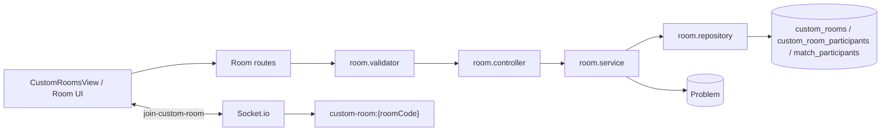

**Flow chi tiết:**
- User (Host) tạo phòng custom -> vào Waiting Room chờ.
- Các Opponent nhập code -> Join phòng.
- Host nhấn "Bắt đầu" khi có >= 2 người -> Backend gom toàn bộ thành `MatchParticipant` -> Bắn socket `MATCH_STARTED` cho cả phòng.
- Khi user join, leave hoặc bi kick, Socket sẽ bắn `PLAYER_JOINED`, `PLAYER_LEFT`, `PLAYER_KICKED` để Frontend fetch lại Room Info thay vì f5.
- Khi trận đấu bắt đầu, Frontend gửi `join-match` để vào room socket dành riêng cho match.
- Mỗi khi có người nộp bài, Socket bắn `RIVAL_SUBMISSION`.
- Thể thức Winner Takes All: Sau khi 1 người nộp bài đúng (AC) đầu tiên, logic `endMatch` ở Backend sẽ tính ELO và bắn `MATCH_ENDED` với kết quả ngay lập tức (không cần F5 trang).
- Toàn bộ người thua bị phạt (vd: -20 ELO). Người thắng được cộng dồn (Tổng ELO phạt).
- Trận đấu kết thúc -> cập nhật `status = FINISHED` cho CustomRoom và Match.

Files lien quan:

- `apps/frontend/src/views/CustomRoomsView.tsx`
- `apps/frontend/src/components/rooms/ActiveRoomsTable.tsx`
- `apps/frontend/src/components/rooms/RoomLobbyPanel.tsx`
- `apps/frontend/src/components/match/RoomBrowser.tsx`
- `apps/frontend/src/services/socket.ts`
- `apps/main-service/src/routes/room.route.ts`
- `apps/main-service/src/controllers/room.controller.ts`
- `apps/main-service/src/services/room.service.ts`
- `apps/main-service/src/repositories/room.repository.ts`
- `apps/main-service/src/validators/room.validator.ts`
- `apps/main-service/src/sockets/socket.ts`
- `apps/main-service/prisma/schema.prisma`

## 6. Contest

Admin tao contest va gan problems. User dang ky, submit bai co `contestId`. 
**Scoreboard (Bảng xếp hạng):** Hệ thống tạo *Static Scoreboard* sau khi (hoặc trong khi) Contest diễn ra bằng cách query lại toàn bộ submissions. Logic tính điểm (`score`) cộng gộp các bài giải đúng và phạt thời gian (`timePenalty` = 20 phút cho mỗi lần nộp sai WA). API này có thể gọi bằng Polling (Frontend gọi 15s/lần) để mô phỏng Realtime mà không làm chết Server.

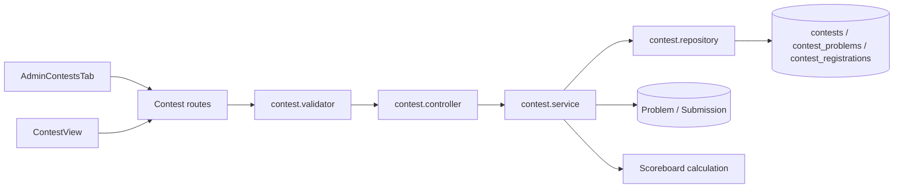

Files lien quan:

- `apps/frontend/src/views/ContestView.tsx`
- `apps/frontend/src/components/contest/ContestScoreboard.tsx`
- `apps/frontend/src/components/admin/AdminContestsTab.tsx`
- `apps/main-service/src/routes/contest.route.ts`
- `apps/main-service/src/controllers/contest.controller.ts`
- `apps/main-service/src/services/contest.service.ts`
- `apps/main-service/src/repositories/contest.repository.ts`
- `apps/main-service/src/validators/contest.validator.ts`
- `apps/main-service/src/models/submission.model.ts`
- `apps/main-service/prisma/schema.prisma`

## 7. Comments And Discussions

User doc comment theo target, tao reply, update/delete comment va like comment. Comment tree luu trong MySQL.

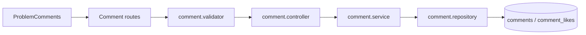

Files lien quan:

- `apps/frontend/src/components/editor/ProblemComments.tsx`
- `apps/main-service/src/routes/comment.route.ts`
- `apps/main-service/src/controllers/comment.controller.ts`
- `apps/main-service/src/services/comment.service.ts`
- `apps/main-service/src/repositories/comment.repository.ts`
- `apps/main-service/src/validators/comment.validator.ts`
- `apps/main-service/prisma/schema.prisma`

## 8. Social Friendship And Online State

Friend request/accept/block/list chay qua REST. Online state duoc Socket.io ghi vao Redis set `online_users`.
Newsfeed cho phep user xem hoat dong cua ban be (nhu hoan thanh bai tap, len rank) va thong bao tu server.

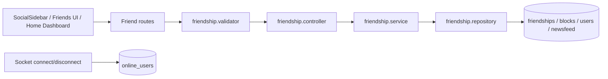

Files lien quan:

- `apps/frontend/src/views/HomeView.tsx`
- `apps/frontend/src/views/FriendsView.tsx`
- `apps/frontend/src/components/layout/SocialSidebar.tsx`
- `apps/main-service/src/routes/friendship.route.ts`
- `apps/main-service/src/controllers/friendship.controller.ts`
- `apps/main-service/src/services/friendship.service.ts`
- `apps/main-service/src/repositories/friendship.repository.ts`
- `apps/main-service/src/validators/friendship.validator.ts`
- `apps/main-service/src/sockets/socket.ts`
- `apps/main-service/prisma/schema.prisma`

## 9. Shop And Inventory

Admin quan ly item shop. User xem shop, mua item bang code coins va equip item trong inventory. 
**Frontend UI:** Giao diện ShopView đã được chuyển hoàn toàn sang Tailwind CSS để tăng tính nhất quán và hiển thị mượt mà.

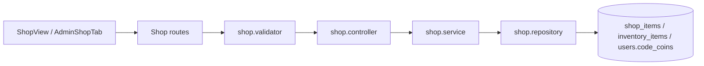

Files lien quan:

- `apps/frontend/src/views/ShopView.tsx`
- `apps/frontend/src/components/admin/AdminShopTab.tsx`
- `apps/main-service/src/routes/shop.route.ts`
- `apps/main-service/src/controllers/shop.controller.ts`
- `apps/main-service/src/services/shop.service.ts`
- `apps/main-service/src/repositories/shop.repository.ts`
- `apps/main-service/src/validators/shop.validator.ts`
- `apps/main-service/prisma/schema.prisma`

## 10. Notification

Notification luu trong MySQL va co the emit realtime qua Socket.io user room hoac Frontend chu dong Polling.
**Polling:** Ở AppShellLayout, Frontend sẽ tự động gọi API lấy danh sách Notification mỗi 30 giây để cập nhật số đếm chưa đọc (`unreadCount`).

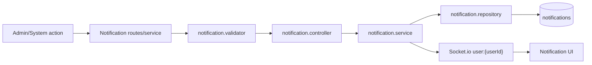

Files lien quan:

- `apps/frontend/src/components/admin/AdminNotificationsTab.tsx`
- `apps/main-service/src/routes/notification.route.ts`
- `apps/main-service/src/controllers/notification.controller.ts`
- `apps/main-service/src/services/notification.service.ts`
- `apps/main-service/src/repositories/notification.repository.ts`
- `apps/main-service/src/validators/notification.validator.ts`
- `apps/main-service/src/sockets/socket.ts`
- `apps/main-service/prisma/schema.prisma`

## 11. Report And Moderation

User tao report. Admin xem danh sach va update status `PENDING`, `RESOLVED`, `REJECTED`.

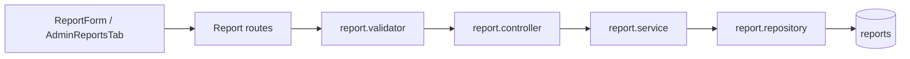

Files lien quan:

- `apps/frontend/src/components/editor/ReportForm.tsx`
- `apps/frontend/src/components/admin/AdminReportsTab.tsx`
- `apps/main-service/src/routes/report.route.ts`
- `apps/main-service/src/controllers/report.controller.ts`
- `apps/main-service/src/services/report.service.ts`
- `apps/main-service/src/repositories/report.repository.ts`
- `apps/main-service/src/validators/report.validator.ts`
- `apps/main-service/prisma/schema.prisma`

## 12. AI Roadmap, Debug Assistant And Mock Interview

AI module dung Google Gemini de tro thanh mot AI Mentor toan dien:
- **Roadmap Loop**: Tao roadmap hoc DSA va lien ket truc tiep cac bai tap goi y toi man hinh giai bai. Du lieu roadmap duoc luu o `roadmaps`, `roadmap_phases`, `roadmap_sessions`.
- **AI Debug Assistant**: Khi user nop bai bi sai (WA, TLE, RE, CE), AI se phan tich code, doc testcase va dua ra goi y de user tu sua loi thay vi chi truc tiep code dung.
- **Mock Interview Chat**: Khi nop bai thanh cong (AC), AI dong vai tro nguoi phong van danh gia do phuc tap va de xuat toi uu thong qua giao dien Chat tuong tac.

Lich su AI (debug, interview) duoc luu lai trong MySQL bang `AiHistory`. Giao dien Chat ho tro tuong tac lien tuc dua vao lich su json tu DB. (API Key Gemini duoc cau hinh bao mat thong qua `.env` server side, ho tro mock/offline fallback neu thieu key).

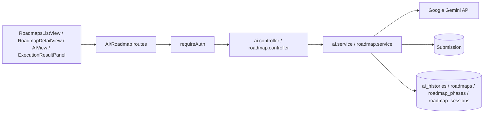

Files lien quan:

- `apps/frontend/src/features/roadmaps/*`
- `apps/frontend/src/views/AIView.tsx`
- `apps/frontend/src/components/editor/ExecutionResultPanel.tsx`
- `apps/main-service/src/routes/ai.route.ts`
- `apps/main-service/src/controllers/ai.controller.ts`
- `apps/main-service/src/services/ai.service.ts`
- `apps/main-service/src/routes/roadmap.route.ts`
- `apps/main-service/src/controllers/roadmap.controller.ts`
- `apps/main-service/src/services/roadmap.service.ts`
- `apps/main-service/src/models/submission.model.ts`
- `apps/main-service/prisma/schema.prisma`

## 13. Leaderboard And User Stats

Leaderboard doc MySQL user/ELO/activity/tag stats. User profile ket hop MySQL profile voi MongoDB submission history.

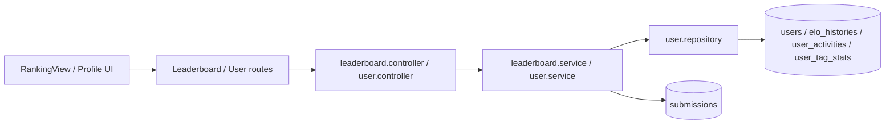

Files lien quan:

- `apps/frontend/src/views/RankingView.tsx`
- `apps/frontend/src/views/SettingsView.tsx`
- `apps/main-service/src/routes/leaderboard.route.ts`
- `apps/main-service/src/controllers/leaderboard.controller.ts`
- `apps/main-service/src/services/leaderboard.service.ts`
- `apps/main-service/src/routes/user.route.ts`
- `apps/main-service/src/controllers/user.controller.ts`
- `apps/main-service/src/services/user.service.ts`
- `apps/main-service/src/repositories/user.repository.ts`
- `apps/main-service/src/validators/user.validator.ts`
- `apps/main-service/prisma/schema.prisma`

## 14. Admin Dashboard

Admin dashboard la tap hop UI thao tac tren nhieu module: users, auth, problems, submissions, rooms, matches, contests, comments, friends, shop, notifications, reports, AI.

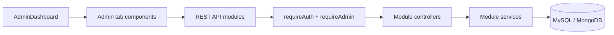

Files lien quan:

- `apps/frontend/src/views/AdminDashboard.tsx`
- `apps/frontend/src/components/admin/*`
- `apps/main-service/src/middlewares/auth.middleware.ts`
- `apps/main-service/src/routes/*`
- `apps/main-service/src/controllers/*`
- `apps/main-service/src/services/*`
- `apps/main-service/prisma/schema.prisma`
