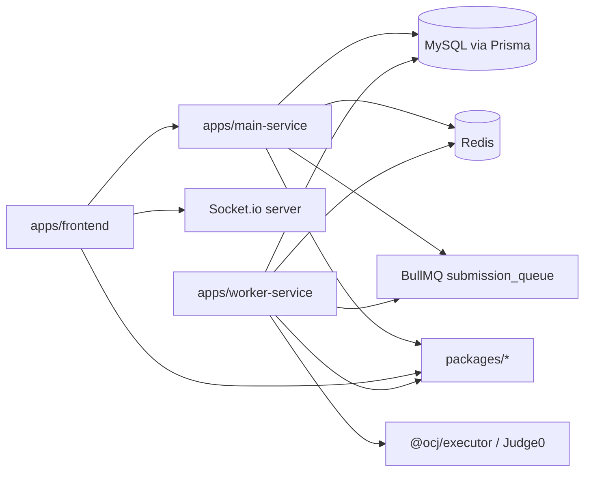

# Project Structure

OCJ la monorepo TypeScript dung npm workspaces va Turborepo. Thu muc goc chua cac app chay runtime, cac package dung chung, cau hinh Docker, script deploy va mot so tai lieu cu.

```text
online-code-judge/
  apps/
    frontend/
    main-service/
    worker-service/
  packages/
    constants/
    errors/
    executor/
    tsconfig/
    types/
    utils/
    validators/
  judge0-server/
  ai_slop/
  ai_slop_2/
  features_slops/
  docker-compose.yml
  package.json
  turbo.json
```

## Apps

### `apps/frontend`

React/Vite client. Frontend dung:

- `@monaco-editor/react` cho code editor.
- `socket.io-client` cho realtime matchmaking, custom room, notification.
- Shared packages `@ocj/constants`, `@ocj/types`, `@ocj/utils`, `@ocj/validators`.

Cau truc noi bo:

```text
src/
  assets/
  components/
    admin/
    auth/
    contest/
    editor/
    layout/
    match/
    rooms/
  context/
  services/
  test/
  views/
```

### `apps/main-service`

Express API service chinh. Service nay ket noi MySQL bang Prisma, Redis bang ioredis/BullMQ, va Socket.io.

Cau truc noi bo:

```text
src/
  config/        # prisma, redis, queue, cloudinary, env
  controllers/   # HTTP controller layer
  middlewares/   # auth, validate, upload, error
  repositories/  # DB access layer
  routes/        # Express route declarations
  scripts/       # seed and utility scripts
  services/      # business logic
  sockets/       # Socket.io and matchmaking
  tests/         # Jest/Supertest tests
  utils/         # jwt, password helpers
  validators/    # Zod validation schemas
```

Route registration nam trong `src/app.ts`. Server bootstrap nam trong `src/server.ts`.

`src/config/env.ts` load `.env` neu co va dat default local dev cho MySQL/Redis de fresh clone co the chay `npm install` roi `npm run dev`.

### `apps/worker-service`

Worker xu ly queue cham bai. Service nay ket noi MySQL va Redis, lang nghe BullMQ queue `submission_queue`, chay code qua `@ocj/executor`, cap nhat submission va publish ket qua qua Redis Pub/Sub.

Cau truc noi bo:

```text
src/
  config/
  tests/
  workers/
```

`src/config/env.ts` dat default local dev cho MySQL/Redis khi chay worker ngoai Docker.

## Shared Packages

| Package | Vai tro |
| --- | --- |
| `@ocj/constants` | Route prefixes, socket events, Redis channels, supported languages, default limits. |
| `@ocj/errors` | Error helpers/classes dung chung. |
| `@ocj/executor` | Logic goi Judge0/local executor va map language id. |
| `@ocj/tsconfig` | TypeScript config chung. |
| `@ocj/types` | Type definitions dung chung FE/BE. |
| `@ocj/utils` | Utility functions, vi du tinh ELO PvP. |
| `@ocj/validators` | Validator/shared validation logic. |

## Root Files

| File | Vai tro |
| --- | --- |
| `package.json` | Khai bao workspace `apps/*`, `packages/*`, script `dev/dev:prepare/build/test/lint/format`. |
| `turbo.json` | Cau hinh Turborepo pipeline. |
| `docker-compose.yml` | Chay frontend, main-service, worker-service, MySQL va Redis. |
| `.env.docker.example` | Mau env cho Docker Compose. |
| `deploy-vps.sh`, `setup_vps.sh` | Script ho tro trien khai VPS. |
| `ocj_postman_collection.json` | Postman collection. |

## High-Level Dependency Direction


