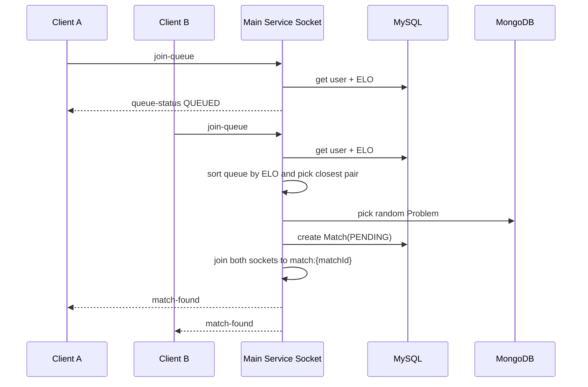

# Realtime And Matchmaking

Realtime duoc xu ly trong main-service bang Socket.io. Socket server duoc tao trong `apps/main-service/src/server.ts` va init trong `apps/main-service/src/sockets/socket.ts`.

## Socket Authentication

Socket handshake can co token:

```text
socket.handshake.auth.token
```

Hoac:

```text
socket.handshake.query.token
```

Token duoc verify bang `verifyAccessToken`. Neu thieu hoac invalid, connection bi reject.

## Socket Events

Events duoc khai bao trong `packages/constants/src/index.ts`.

| Event | Direction | Vai tro |
| --- | --- | --- |
| `connect` | client -> server | Ket noi socket. |
| `disconnect` | client -> server | Ngat ket noi, remove user khoi queue va online set. |
| `error` | server -> client | Bao loi socket/action. |
| `join-queue` | client -> server | Vao matchmaking queue. |
| `leave-queue` | client -> server | Roi matchmaking queue. |
| `forfeit-match` | client -> server | Dau hang/roi match. |
| `join-custom-room` | client -> server | Join socket room custom. |
| `leave-custom-room` | client -> server | Roi socket room custom. |
| `join-match` | client -> server | Vao room cua tran dau Custom Arena. |
| `leave-match` | client -> server | Roi room cua tran dau Custom Arena. |
| `queue-status` | server -> client | Trang thai queue cua user. |
| `match-found` | server -> client | Da tim thay tran 1v1. |
| `rival-submission` | server -> client | Doi thu vua co submission update. |
| `match-ended` | server -> client | Tran ket thuc va ELO updated. |
| `match-started` | server -> client | Event danh cho custom/room flow. |
| `player-left` | server -> client | Co player roi phong/tran. |
| `player-joined` | server -> client | Co player tham gia phong custom. |
| `player-kicked` | server -> client | Chu phong kick player khoi phong. |
| `config-updated` | server -> client | Cau hinh room thay doi. |
| `room-deleted` | server -> client | Room bi xoa. |
| `notification` | server -> client | Notification realtime. |

## Rooms

| Room name | Muc dich |
| --- | --- |
| `user:{userId}` | Room rieng tung user, dung cho notification/direct event. |
| `match:{matchId}` | Room cua tran 1v1 matchmaking. |
| `custom-room:{roomCode}` | Room realtime cua custom room. |

## Online Users

Khi socket connect:

```text
redis.sadd('online_users', userId)
```

Khi disconnect:

```text
redis.srem('online_users', userId)
```

## Matchmaking Flow



## Matchmaking Algorithm

Implementation: `apps/main-service/src/sockets/matchmaking.ts`

1. Queue luu in-memory trong bien `matchmakingQueue`.
2. Moi player co `userId`, `socketId`, `username`, `elo`.
3. Khi co it nhat 2 player, sort queue theo ELO tang dan.
4. Tim cap player lien ke co ELO diff nho nhat.
5. Remove 2 player khoi queue.
6. Pick random MongoDB `Problem`.
7. Tao MySQL `Match` status `PENDING`.
8. Emit `match-found`.

## Submission Update In Match

```mermaid
flowchart LR
  Worker[Worker Service] -->|publish submission-updates| Redis[(Redis)]
  Redis -->|subscribe| Socket[Main Service Socket]
  Socket -->|handleSubmissionUpdate| Match[Find active MySQL Match]
  Match --> Emit[RIVAL_SUBMISSION]
  Match -->|ACCEPTED (N-player)| End[endMatch transaction]
  End --> Elo[Update ELO and streak for Winner Takes All]
  End --> Done[MATCH_ENDED]
```

## Forfeit

Client emit:

```text
forfeit-match
```

Payload:

```json
{
  "matchId": "..."
}
```

Server tim match, xac dinh user con lai la winner, sau do goi `endMatch`.

## Active Match Recovery (F5 Reload)

Khi user dang trong mot tran dau (`status: PENDING`) nhung vo tinh F5 hoac bi mat mang ket noi lai:
1. Sockets se bi disconnect.
2. Frontend se tu dong goi API `GET /api/v1/matches/active` de kiem tra xem co match nao dang `PENDING` khong.
3. Neu co, he thong se block user tim tran moi va hien thi banner de user click vao quay tro lai URL `/match/:matchId`.
4. Khi vao lai URL `/match/:matchId`, user se tu dong join lai Socket room `match:{matchId}`.

## Production Notes

Matchmaking queue dang nam trong memory cua mot main-service instance. Neu scale nhieu instance, can dua queue sang Redis hoac dung sticky session + centralized matchmaking service.
