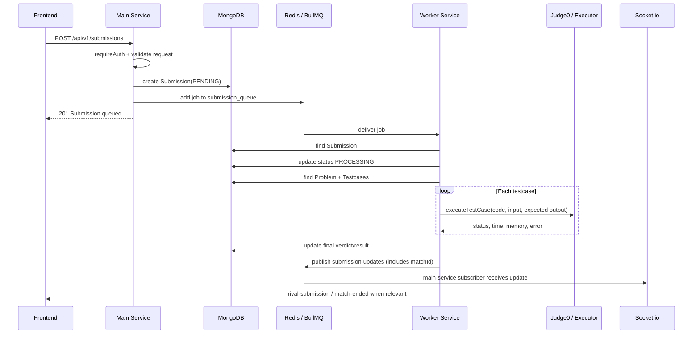

# Submission Flow

Submission flow duoc thiet ke bat dong bo: HTTP request chi tao submission va enqueue job; worker-service xu ly cham bai rieng.

## Main Sequence



## Queue

Queue duoc khai bao trong `apps/main-service/src/config/queue.ts`:

```text
queue name: submission_queue
attempts: 3
backoff: exponential, delay 1000ms
removeOnComplete: true
removeOnFail: false
```

Worker lang nghe cung queue trong `apps/worker-service/src/workers/submission.worker.ts` voi concurrency:

```text
concurrency: 2
```

## Submission Create

Endpoint chinh:

```text
POST /api/v1/submissions
```

Route:

```text
apps/main-service/src/routes/submission.route.ts
```

Request:

- `problemId` (required)
- `language`: `cpp`, `java`, hoac `python` (required)
- `code` (required)
- `matchId` (optional) — link submission to a PvP match
- `contestId` (optional) — link submission to a contest

Submission duoc tao trong MongoDB voi status ban dau:

```text
PENDING
```

### Submission Model Fields

| Field | Type | Required | Indexed | Notes |
|-------|------|----------|---------|-------|
| `userId` | string | ✅ | ✅ | |
| `problemId` | ObjectId (ref: Problem) | ✅ | ✅ | |
| `code` | string | ✅ | | |
| `language` | enum (cpp/java/python) | ✅ | | |
| `status` | enum | ✅ (default PENDING) | ✅ | See Verdicts |
| `matchId` | string (nullable) | | ✅ | Links to MySQL `matches.id` |
| `contestId` | string (nullable) | | ✅ | Links to contest |
| `executionTime` | number | | | |
| `memoryUsed` | number | | | |
| `errorMessage` | string | | | |
| `testCasesPassed` | number | | | Default 0 |
| `testCasesTotal` | number | | | Default 0 |
| `aiFeedback` | string | | | |

## Worker Processing

Worker job data gom:

- `submissionId`
- `code`
- `language`
- `problemId`
- `matchId` (optional, read from Submission)

Xu ly:

1. Tim `Submission` theo `submissionId`.
2. Doi status sang `PROCESSING`.
3. Tim `Problem` theo `problemId`.
4. Tim tat ca `Testcase` theo `problemId`.
5. Map language sang Judge0 language id qua `getLanguageId`.
6. Chay tung testcase bang `executeTestCase`.
7. Dung o testcase fail dau tien.
8. Cap nhat final status, time, memory, passed/total.
9. Publish Redis channel `submission-updates` (kèm `matchId` nếu có).

## Verdicts

MongoDB `Submission.status` co cac gia tri:

```text
PENDING
PROCESSING
ACCEPTED
WA
TLE
MLE
RE
CE
```

Trong worker:

- Khong tim thay problem -> `CE`, `Problem context not found`.
- Khong co testcase -> `CE`, `No testcases found for this problem`.
- Exception khi worker chay -> `RE`.

## Redis Pub/Sub Payload

Worker publish len channel `submission-updates`:

```json
{
  "submissionId": "...",
  "userId": "...",
  "problemId": "...",
  "status": "ACCEPTED",
  "testCasesPassed": 10,
  "testCasesTotal": 10,
  "matchId": "..."  (optional — only for PvP submissions)
}
```

Main-service subscribe channel nay trong `src/sockets/socket.ts`, sau do goi `handleSubmissionUpdate`.

## Match Integration

Khi submission update lien quan den match dang `PENDING`:

1. Main-service nhan `matchId` tu pub/sub payload.
2. Neu co `matchId`, tim `Match` directly qua `prisma.match.findUnique({ id: matchId })`.
3. Neu KHONG co `matchId` (legacy submissions cu), fallback tim `Match` theo `problem_id`, `userId`, status `PENDING`. (deprecated — chi ton tai cho submissions tao truoc khi `matchId` duoc them vao model)
4. Emit `rival-submission` vao room `match:{matchId}`.
5. Neu status la `ACCEPTED`, goi `endMatch`.
6. `endMatch` update MySQL `matches`, user ELO/streak bang Prisma transaction.
7. Emit `match-ended`.

## Known Limitations

- **`matchId` cross-database reference**: `matchId` trong MongoDB `Submission` tham chieu toi `Match` trong MySQL/Prisma. Khong co foreign key integrity tu dong — day la tham chieu logic, khong duoc DB engine kiem tra. Code phai xu ly case match khong ton tai (da xu ly: return early).

## Ad-Hoc Run

Endpoint:

```text
POST /api/v1/submissions/run
```

Muc dich: chay code nhanh, khong tao persistent submission theo route description.
