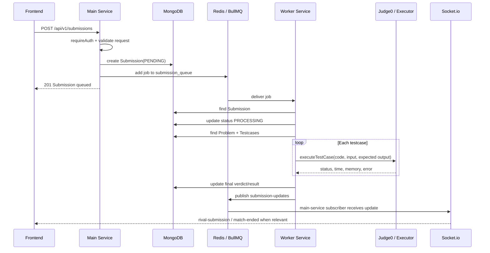

# Submission Flow

Submission flow duoc thiet ke bat dong bo: HTTP request chi tao submission va enqueue job; worker-service xu ly cham bai rieng.

## Main Sequence



## Queue

Queue duoc khai bao trong `apps/main-service/src/config/queue.ts`:

```text
queue name: submission_queue
attempts: 3
backoff: exponential, delay 1000ms
removeOnComplete: true
removeOnFail: false
```

Worker lang nghe cung queue trong `apps/worker-service/src/workers/submission.worker.ts` voi concurrency:

```text
concurrency: 2
```

## Submission Create

Endpoint chinh:

```text
POST /api/v1/submissions
```

Route:

```text
apps/main-service/src/routes/submission.route.ts
```

Request yeu cau:

- `problemId`
- `language`: `cpp`, `java`, hoac `python`
- `code`

Submission duoc tao trong MongoDB voi status ban dau:

```text
PENDING
```

## Worker Processing

Worker job data gom:

- `submissionId`
- `code`
- `language`
- `problemId`

Xu ly:

1. Tim `Submission` theo `submissionId`.
2. Doi status sang `PROCESSING`.
3. Tim `Problem` theo `problemId`.
4. Tim tat ca `Testcase` theo `problemId`.
5. Map language sang Judge0 language id qua `getLanguageId`.
6. Chay tung testcase bang `executeTestCase`.
7. Dung o testcase fail dau tien.
8. Cap nhat final status, time, memory, passed/total.
9. Publish Redis channel `submission-updates`.

## Verdicts

MongoDB `Submission.status` co cac gia tri:

```text
PENDING
PROCESSING
ACCEPTED
WA
TLE
MLE
RE
CE
```

Trong worker:

- Khong tim thay problem -> `CE`, `Problem context not found`.
- Khong co testcase -> `CE`, `No testcases found for this problem`.
- Exception khi worker chay -> `RE`.

## Redis Pub/Sub Payload

Worker publish len channel `submission-updates`:

```json
{
  "submissionId": "...",
  "userId": "...",
  "problemId": "...",
  "status": "ACCEPTED",
  "testCasesPassed": 10,
  "testCasesTotal": 10
}
```

Main-service subscribe channel nay trong `src/sockets/socket.ts`, sau do goi `handleSubmissionUpdate`.

## Match Integration

Khi submission update lien quan den match dang `PENDING`:

1. Main-service tim `Match` theo `problem_id`, `userId`, status `PENDING`.
2. Emit `rival-submission` vao room `match:{matchId}`.
3. Neu status la `ACCEPTED`, goi `endMatch`.
4. `endMatch` update MySQL `matches`, user ELO/streak bang Prisma transaction.
5. Emit `match-ended`.

## Ad-Hoc Run

Endpoint:

```text
POST /api/v1/submissions/run
```

Muc dich: chay code nhanh, khong tao persistent submission theo route description.
